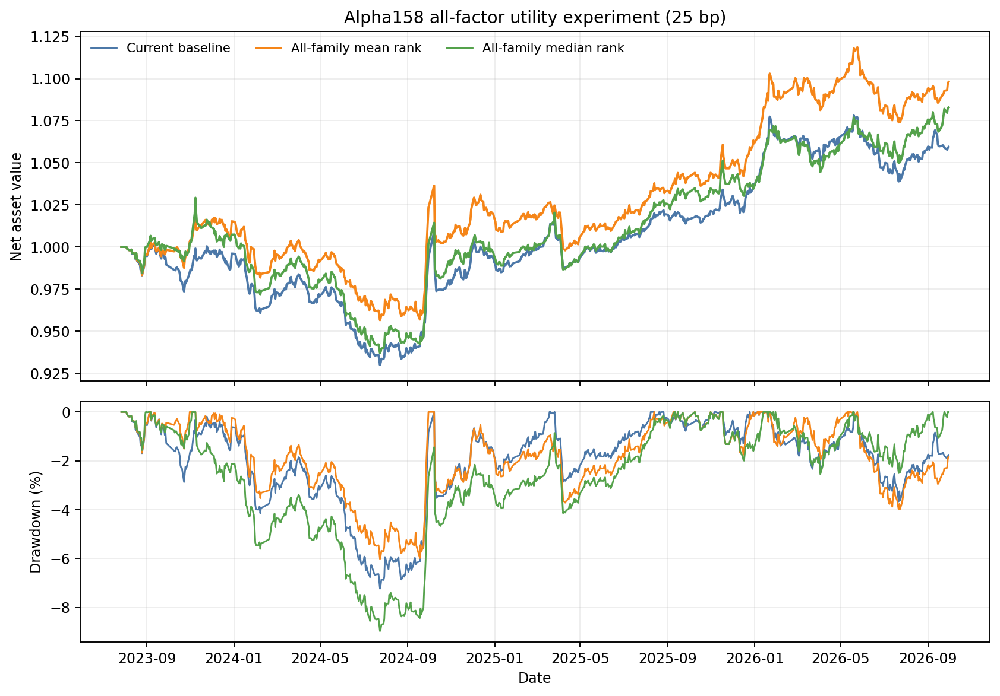

# Alpha158 全因子效用实验（2026-10-06）

## 结论

本轮找到一个明显优于当前基线的历史候选：`all_mean_rank`，即把七个具有统一严格
样本外分数的因子族按交易日转成横截面排名后等权平均。25bp 成本下，它将累计收益从
5.94% 提高到 9.81%，年化收益从 1.83% 提高到 2.99%，最大回撤从 7.23% 降到
6.02%。平均股票仓位从 12.72% 降到 11.97%，所以收益改善不是依靠提高资金暴露取得。

这个候选仍不能直接替换当前正式策略。冻结的严格组合门槛没有全部通过：25bp 下配对
年化收益增量的 95% 区间为 `[-0.74pp, +3.06pp]`，仍跨过零；日度 95% ES 从
-0.591% 小幅变差到 -0.617%；40/60bp 的平均仓位差超过冻结的 1 个百分点可比性
限制。实验最终决定保持为：

```text
REJECT_ALL_FACTOR_ENSEMBLES
```

这里的“拒绝”表示不获准进入正式策略，不表示点估计没有研究价值。`all_mean_rank` 是本轮
唯一通过因子层门槛、并在三档成本下同时提高收益和改善最大回撤的候选，适合冻结后进入
新的前瞻 shadow；当前企业微信模拟盘和订单逻辑不变。



## 因子覆盖范围

当前共登记 183 个因子，按照能否进行可审计历史验证分为三层：

| 层级 | 数量 | 内容 | 本次用途 |
|---|---:|---|---|
| 严格历史主实验 | 161 | 当前 26 因子、130 个 canonical 技术因子、5 个残差趋势/过热因子 | 进入统一合成和回测 |
| 历史回查旁证 | 11 | 4 个 BaoStock 估值因子、7 个龙虎榜因子 | 不混入严格 PIT 主结果 |
| 前瞻限定 | 11 | 7 个财务质量/增长因子、4 个行业环境因子 | 只有 forward shadow，无历史修订链 |

因此，本实验覆盖了全部 183 个已登记因子的当前证据，但没有把口径不同的 183 项强行放进
同一个历史模型。这样可以避免将 2026 年回查到的数据伪装成当时可见数据。

## 防止过拟合的实验设计

- 实验配置和两条候选臂在查看组合结果前冻结；
- 主实验只使用七个完整因子族：回归趋势、价格位置、量能结构、量价持续性、KBar、
  VWAP 相对价格、残差趋势/过热；
- 只比较等权平均排名和中位数排名，不拟合家族权重、不搜索阈值、不按结果删除弱因子族；
- 每个家族沿用相同的滚动训练、验证、标签隔离和严格样本外日期；
- 样本外区间为 2023-07-27 至 2026-09-30，共 772 个交易日；
- 同时检验 25/40/60bp 三档成本；
- 因子层使用 20 日区块自助法、5,000 次重复和 Benjamini-Hochberg 多重检验校正；
- 组合层同时比较收益、年化、最大回撤、日度 ES、跌停流动性压力、资金暴露和 Calmar；
- 所有日期都曾被此前研究观察，因此即使通过也只能开启新前瞻 shadow，不能自动准入。

## 因子层结果

七个家族单独加入基线时的统一结果如下。组合列是 25bp 下相对当前基线的百分点变化；
最大回撤增量为正表示回撤缩小。

| 因子族 | IC 增量 | Top10 增量 | 累计收益增量 | 最大回撤增量 | 单家族决定 |
|---|---:|---:|---:|---:|---|
| 回归趋势 | -0.00011 | -0.0946pp | +0.62pp | -0.45pp | 拒绝 |
| 价格位置 | +0.00255 | -0.1584pp | +8.72pp | +2.48pp | 拒绝 |
| 量能结构 | -0.00267 | +0.0300pp | +1.56pp | +2.16pp | 拒绝 |
| 量价持续性 | +0.00785 | +0.5838pp | +3.64pp | +1.35pp | 拒绝 |
| KBar 形态 | +0.00022 | -0.1500pp | +0.56pp | +0.87pp | 拒绝 |
| VWAP 相对价格 | +0.00001 | -0.0802pp | +0.47pp | +0.28pp | 拒绝 |
| 残差趋势/过热 | +0.00118 | -0.2818pp | -1.60pp | -0.96pp | 拒绝 |

单家族结果说明，价格位置和量价持续性有较强组合点估计，但前者 Top10 能力下降，后者未
通过冻结的多重检验门槛；其他家族也各有明显缺项。不能根据这张表事后只挑两个表现最好的
家族。等权合成的目的正是用预先固定的方法检验这些不稳定信号能否在组合后形成一致增益。

| 候选 | Rank IC | IC 增量及 95% 区间 | Top10 超额收益 | Top10 增量及 95% 区间 | 年度方向 | 门槛 |
|---|---:|---:|---:|---:|---:|---|
| 当前 26 因子基线 | 0.12717 | — | 0.7898% | — | — | 对照 |
| 七族等权平均 | 0.13174 | +0.00456 `[+0.00223,+0.00701]` | 1.0680% | +0.2782pp `[+0.0305,+0.5453]` | 4/4 为正 | **PASS** |
| 七族中位数 | 0.12952 | +0.00235 `[+0.00119,+0.00366]` | 0.7596% | -0.0302pp `[-0.1921,+0.1272]` | 4/4 为正 | FAIL |

等权平均的 IC 和 Top10 增量区间都完全位于零以上，FDR q 值为 0.0006。中位数组合虽然
提高了全横截面 IC，但没有改善最关键的 Top10 候选，因此不应继续。

## 组合层结果

### 三档交易成本

| 成本 | 策略 | 累计收益 | 年化收益 | 最大回撤 | 平均股票仓位 | Calmar | 日度 ES95 |
|---:|---|---:|---:|---:|---:|---:|---:|
| 25bp | 当前基线 | 5.94% | 1.83% | -7.23% | 12.72% | 0.253 | -0.591% |
| 25bp | 七族等权平均 | **9.81%** | **2.99%** | **-6.02%** | 11.97% | **0.496** | -0.617% |
| 25bp | 七族中位数 | 8.29% | 2.54% | -8.97% | 12.06% | 0.283 | -0.606% |
| 40bp | 当前基线 | 2.02% | 0.63% | -7.77% | 12.59% | 0.081 | -0.609% |
| 40bp | 七族等权平均 | **7.59%** | **2.33%** | **-6.71%** | 11.37% | **0.347** | **-0.595%** |
| 60bp | 当前基线 | 0.53% | 0.17% | -8.32% | 12.73% | 0.020 | -0.620% |
| 60bp | 七族等权平均 | **8.97%** | **2.74%** | **-7.37%** | 11.34% | **0.372** | **-0.587%** |

25bp 下，等权平均累计收益增加 3.86 个百分点，最大回撤减少 1.22 个百分点，相对缩小
约 16.8%，Calmar 接近翻倍。40bp 和 60bp 下收益、最大回撤、ES 和流动性压力结果也都
优于基线。不同成本会改变现金、风险额度和后续成交路径，所以三档结果是独立重放，不能把
60bp 结果理解为在 25bp 的固定成交上简单多扣费用。

等权平均候选仍低于同区间沪深 300 的 11.67% 累计收益，但差距从基线的 5.73 个百分点
缩小到 1.86 个百分点。由于策略平均股票仓位只有约 12%，不能把其全账户收益率和满仓指数
直接视为同风险比较；本轮更重要的改善是单位仓位收益从 0.467 提高到 0.819。

### 年度切片（25bp）

| 年份 | 当前基线 | 七族等权平均 | 增量 |
|---:|---:|---:|---:|
| 2023（7月27日起） | -0.40% | 1.52% | +1.92pp |
| 2024 | -0.47% | 0.25% | +0.72pp |
| 2025 | 4.53% | 4.30% | -0.24pp |
| 2026（至9月30日） | 2.23% | 3.45% | +1.21pp |

组合收益在四个年度切片中的三个优于基线，2025 年略弱；因子层 IC 增量则四年同向为正。
这比单一时期获利稳健，但完整自然年度仍然只有两个，统计历史不足是不能立即替换策略的
主要原因。

## 收益改善的来源

25bp 下，当前基线完成 236 次买入，等权平均候选完成 213 次。总摩擦成本从初始资金的
2.395% 降到 2.093%，贡献约 0.30 个百分点；固定成交路径参考收益从 8.34% 提高到
11.90%，贡献约 3.56 个百分点。按这个分解，约 92% 的累计收益增量来自候选排序改变后的
选股和持仓路径，约 8% 来自更低换手成本。

等权平均能够保留多个因子族一致支持的候选，同时平滑单一家族的极端评分。这是对结果的
合理解释，但不是新的独立检验。不能在本轮结果之后再提高表现较好家族的权重，否则会把
解释转化为后验调参。

## 未通过正式准入的具体原因

1. 25bp 配对年化收益增量为 +1.15pp，但区块自助法 95% 区间仍跨过零；
2. 25bp 日度 ES95 小幅变差 0.0255 个百分点，未满足“所有成本下尾部损失不恶化”；
3. 40/60bp 下平均仓位分别降低 1.23 和 1.39 个百分点，超过冻结的 1pp 可比性门槛；
   方向本身更保守，但说明部分改善可能与路径和暴露变化有关；
4. 历史全部已被此前研究观察，没有新的真正未见样本；
5. 中位数方案 Top10 能力下降，最大回撤在三档成本下都扩大，应直接淘汰。

## 当前决定与下一步

- 正式策略继续使用当前 26 因子 Ridge 和 `event_exit_only` 交易规则；
- 不启用中位数方案，也不继续搜索家族权重或子集；
- 将七族等权平均定义为唯一下一阶段候选，冻结计算方法后进行前瞻 shadow；
- 前瞻评估重点检查 Top10 实际收益、25bp 日度 ES、成交后收益、平均暴露和最大回撤；
- 至少积累一个预注册评估节点，再决定是否进行有限资金模拟盘，不从现有历史重复筛选。

## 产物

- 冻结配置：`configs/selection/alpha158_all_factor_utility_v1.json`；
- 回测器：`scripts/validate_alpha158_all_factor_utility_v1.py`；
- 完整结果：`/Users/wjy/abu/backtests/alpha158_all_factor_utility_v1_20261006_v2`；
- 完整报告 SHA256：`23ee0f805a2799c4502d45a503f22aa164745233d16e02a366140a2610cfc05a`。
