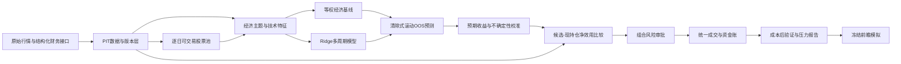

# Alpha158 多因子与成本感知组合 v4 设计规格

| 项目 | 定义 |
|---|---|
| 版本 | `alpha158_multifactor_cost_aware_v4` |
| 状态 | 架构规格；尚未冻结实验参数，尚未产生准入证据 |
| 目标 | 在现有严格 PIT 横截面框架中加入经济基本面因子，将多周期预期收益、交易成本和组合风险统一到换仓决策中 |
| 历史区间 | 2022—2026 年只能用于开发诊断，不得重新定义为独立留出样本 |
| 冻结对照 | `alpha158_lite_v1`、`alpha158_lite_turnover_v2`、`alpha158_lite_low_turnover_v3` |
| 实盘状态 | 禁止；即使历史门禁通过，也只能进入冻结前瞻模拟 |

## 1. 背景与问题定义

现有研究已经确认：

- `alpha158_lite_v1` 的样本外横截面 Rank IC 为正，但每日排名换仓使成本后组合亏损；
- `alpha158_lite_low_turnover_v3` 通过五日评估、持续性确认、排名迟滞和最低持有期，把历史成本后收益改善为正；
- v3 收益仍低于同期沪深300，年度稳定性和三个跌停压力情景未通过；
- 当前26个特征主要覆盖价格、趋势、波动、流动性和行业，缺少价值、质量、投资等基本面经济主题；
- 当前模型输出是横截面排序分数，不是可直接与交易成本相减的预期收益百分点。

因此 v4 不继续调整 v1/v2/v3 的历史参数，也不把更复杂模型作为首要改进。v4 解决四个独立问题：

1. 建立可审计的 PIT 基本面数据层；
2. 建立强于现有趋势分数的经济多因子基线；
3. 把排序分数校准为带不确定性的多周期预期收益；
4. 只在候选相对现持仓的预期净效用足以覆盖成本和风险时换仓。

## 2. 范围与非目标

### 2.1 v4 范围

- A股日线横截面研究；
- PIT 行情、生命周期、行业、ST、股本和财务报表；
- 价值、质量、投资、动量和流动性/可实施性主题；
- 等权经济基线、Ridge 和一次预登记的 GBDT 挑战；
- 多周期 OOS 收益校准；
- 成本感知换仓、行业和规模暴露控制；
- 统一执行器、风险引擎、匹配型随机组合和前瞻模拟。

### 2.2 非目标

- 不修改 v1/v2/v3 的配置、交易清单或历史结论；
- 不在2022—2026年搜索最优 Top-k、评估频率、持有期或替换数量；
- 不预测分钟级成交，不假装日线数据能够重建盘中止损路径；
- 不在基本面 PIT 数据验收前训练模型；
- 不把 Rank IC、AUC、单年盈利或固定路径毛收益当作最终准入依据；
- 不在 Ridge 和经济基线失败后继续尝试神经网络或多个模型家族。

## 3. 总体架构



策略层只产生候选、预期收益期限结构、置信下界和持仓继续持有价值。组合层决定是否换仓和目标风险；执行层决定订单是否可成交以及实际成交价。

## 4. 数据契约

### 4.1 复用数据

以下现有能力直接复用：

- 前复权信号行情与原始成交行情；
- 成交额、流通股本、换手率和流通市值；
- 证券主表、上市退市、停复牌、公司行为；
- 深圳历史名称/ST、历史行业；
- 沪深300基准；
- 原始数据缓存、快照清单和审计输出。

当前 `market_cap = outstanding_share × raw_close` 表示流通市值。它可用于容量和流通规模控制，但不得作为 E/P、CFO/P 等估值指标的总市值分母。

### 4.2 新增基本面事件表

新增规范化长表 `fundamental_facts`，每行至少包含：

| 字段 | 含义 |
|---|---|
| `symbol` | 证券标识 |
| `statement_type` | 利润表、资产负债表、现金流量表或股本表 |
| `report_period` | 报告期末 |
| `report_kind` | 一季报、中报、三季报、年报 |
| `announcement_date` | 来源披露日期 |
| `available_at` | 研究系统允许使用的最早时间 |
| `revision_id` | 同一报告期的修订版本 |
| `is_restated` | 是否更正/重述 |
| `source`、`source_key` | 来源及原始记录键 |
| `ingested_at` | 下载入库时间 |
| `currency`、`unit_scale` | 币种和单位 |
| `field`、`value` | 标准化科目和值 |
| `raw_payload_sha256` | 原始响应内容哈希 |

首轮核心科目：

- 营业收入、营业成本；
- 归母净利润；
- 经营活动现金流净额；
- 购建固定资产、无形资产和其他长期资产支付的现金；
- 总资产、总负债、归母权益；
- 总股本、流通股本。

### 4.2.1 结构化接口优先路由

当前阶段优先使用东方财富结构化三大表和巨潮结构化股本变动接口，暂不批量解析 PDF 正文，也不把公告目录作为本阶段的数值来源。

- 每次接口结果仍必须按内容哈希不可变保存，不得覆盖旧快照；
- 只有报告期、公告日、更新日、币种和单位均可确认的记录才能进入 PIT 层；
- 当 `UPDATE_DATE > NOTICE_DATE` 时，当前快照数值只能从 `UPDATE_DATE` 后生效，不得倒填至原公告日；
- 接口只返回当前版本时，要显式标记 `revision_history_complete=false`，不得伪装已恢复更正前数值；
- CNINFO `p_stock2215` 的 `F003N` 作为总股本候选，A股流通市值只使用 `F022N`“人民币普通股”；`F021N`“已流通股份”可能包含B/H股，不得与A股收盘价相乘；
- 股本事件采用双时间选择：先按 `available_at` 判断当时是否已知，再从已知记录中取经济变动日期最新的状态；较晚公告但报告期更早的定期快照不得回滚较新的真实变动；
- 新浪日线 `outstanding_share` 仅作为A股流通股本辅助校验或主来源缺失时的显式降级，不得静默覆盖CNINFO；超过冻结容差的差异必须进入冲突报告；
- Baostock 日线 `isST` 只允许作为历史ST排除源，`isST=1`和精确日期状态未知均不得进入候选池；该字段不得作为Alpha、确认或排序输入；由成交量和换手率反推的流通股本仍只是近似审计证据，因换手率舍入会产生噪声，不得直接覆盖或补全正式股本；
- 辅助源只有在全市场覆盖、时间边界、退市样本、来源版本和冲突仲裁均通过独立审查后，才能通过新配置版本升级为正式来源；试点覆盖通过不等于M4门禁通过；
- PDF 和公告版本解析保留为后续降级或补证路径，本阶段不实施。

### 4.3 PIT可见性

- 信号日收盘后的特征只能使用 `available_at <= signal_close` 的记录；
- 来源只有公告日期而没有时刻时，保守地从下一交易日开盘前可见，不允许公告当日收盘信号使用；
- 更正公告只从更正 `available_at` 起生效，不允许覆盖更正前历史快照；
- 对只暴露当前版本的结构化记录，`available_at` 使用 `NOTICE_DATE` 和 `UPDATE_DATE` 较晚日期的下一交易日；较早区间保留为不可用；
- TTM 只能由当时可见的单季或累计值构造；
- 年报缺失不得用未来年报回填；
- 缺失值必须保留缺失原因，不得把缺失默认解释成低估值、低投资或低质量。

### 4.4 数据验收门槛

在训练任何 v4 模型前必须生成数据覆盖报告，并同时满足：

- 证券日生命周期/ST可判定率不低于99.5%；
- 主样本中每个核心经济主题的日期中位覆盖率不低于80%；
- 每日主题覆盖率的10%分位数不低于70%；
- 总市值、流通市值和股本单位抽样勾稽通过；
- 上海与深圳的历史ST必须由逐日状态或可重放事件覆盖，并对未知状态失败关闭；
- 公告日边界、修订前后值和TTM构造测试全部通过；
- 任一交易所历史ST逐日覆盖低于门槛时，全市场主实验失败关闭；已通过审计的排除专用来源必须绑定快照哈希并保持未知状态失败关闭。

门槛未通过时不得通过横截面中位数填充把数据问题隐藏起来。

## 5. 股票池与规模控制

信号日基础资格沿用 v1：

- 已上市且未超过退市日；
- 至少252个有效交易日；
- 复权信号与原始成交行情有效；
- PIT ST状态已知且当日非ST；
- 近20日成交额中位数不少于2,000万元；
- ATR、行业、总市值和流通市值满足对应实验要求。

冻结实验必须同时报告三个股票池：

1. `size_controlled_primary`：按当日总市值排除最小30%；
2. `all_eligible_sensitivity`：不做市值分位排除；
3. `large_mid_sensitivity`：仅保留总市值前50%。

30%和50%是预登记的敏感性口径，不允许根据收益结果移动。所有市值分位只使用当日合格股票计算。容量限制仍使用流通市值、成交额和ADV，不得用总市值替代。

## 6. 因子体系

### 6.1 基本面主题

所有比率使用当日可见的TTM或报告期值，并对分母非正、币种不一致和单位异常失败关闭。

| 主题 | 首轮字段 | 方向 |
|---|---|---|
| 价值 | `E/P = TTM归母净利润 / 总市值`；`CFO/P = TTM经营现金流 / 总市值` | 越高越好 |
| 质量 | 毛利润/平均总资产；ROA；CFO/平均总资产 | 越高越好 |
| 投资 | 总资产同比增长；资本开支同比增长 | 取负后越高越好 |
| 动量 | 12-1月动量；6-1月动量；短期反转 | 中长期正向、短期收益取反 |
| 流动性Alpha | Amihud、零成交率、换手稳定性 | 单独报告，不预设等同于可交易性 |

### 6.2 可实施性字段

以下字段进入成本和容量模型，不与 Alpha 主题混为一个等权分数：

- 20/60日成交额；
- 流通市值；
- 换手率及稳定性；
- 计划成交额/20日ADV；
- 涨跌停和停牌概率代理；
- 历史跳空和滑点代理。

流动性可能同时包含风险溢价和高交易成本，必须分别保存 `liquidity_alpha` 与 `tradability_score`，避免用“越不流动预期收益越高”抵消执行失败。

### 6.3 技术主题

现有26个 Alpha158-lite 特征原样保留为 `technical_v1`，不得在 v4 首轮中逐个挑选。VCP只允许作为一个预定义的技术确认字段或独立对照，不作为股票池硬门槛。

### 6.4 横截面处理

每个信号日按以下固定顺序处理：

1. 按PIT股票池过滤；
2. 原始比率按当日1%/99%分位缩尾；
3. 对连续变量按 `行业哑变量 + log(总市值)` 做横截面中性化；
4. 残差转换为同日中心化百分位秩 `[-0.5, 0.5]`；
5. 每个主题内部等权合成，再在主题之间等权；
6. 保存原始值、缩尾值、中性化值、排名值和缺失原因。

主题至少需要两个有效组成字段；不足时主题值缺失。不得因为某个主题字段更多而自动获得更高权重。

## 7. 冻结基线与模型顺序

必须按顺序运行，上一层未通过时停止：

| 编号 | 信号 | 组合层 | 目的 |
|---|---|---|---|
| B0 | 现有趋势质量分数 | 冻结v3 | 保留弱历史基线 |
| B1 | 现有价格技术Ridge | 冻结v3 | 保留当前最强价格模型 |
| B2 | 经济主题等权 | 冻结v3 | 建立可解释学术基线 |
| B3 | 经济主题+technical_v1 Ridge | 冻结v3 | 判断线性学习的增量 |
| B4 | B3多周期校准 | 成本感知v4 | 判断预测能否转化为净效用 |
| B5 | 单一预登记GBDT | 成本感知v4 | 仅在B4通过后挑战Ridge |

所有基线使用相同股票池、执行器、风险约束和成本。若持股数、行业、规模或平均暴露不同，必须同时提供匹配暴露版本，不能只比较总收益。

## 8. 标签、滚动验证与收益校准

### 8.1 标签

标签继续从 `t+1` 可执行开盘开始，并减去同期沪深300收益。保存5、10、20、60交易日的原始超额收益和同日横截面秩。

不可成交、开盘涨停、跳空超过最高买价或加入冻结滑点后无法成交的样本没有标签。标签逻辑必须调用或镜像统一执行器，并由一致性测试约束。

### 8.2 滚动验证

- expanding train；
- 训练、校准、测试三段隔离；
- 按最长60日标签执行purge；
- 模型和缺失填充只在训练段拟合；
- 收益校准只在校准段拟合；
- 测试块不得影响因子、模型、校准器或组合参数；
- 每个信号日样本总权重相同。

### 8.3 从Rank到预期收益

不得直接执行：

```text
alpha_score - transaction_cost
```

对每个期限 `h`，使用更早训练/校准数据建立：

```text
alpha_score_h -> expected_excess_return_bps_h
              -> lower_confidence_bound_bps_h
```

首轮校准器使用预登记的单调分箱或保序回归；每个测试块只能使用此前校准块。输出必须包含样本数、均值、中位数、标准误、区块Bootstrap区间和校准误差。

成本感知组合的主要收益期限固定为10日与20日等权：

```text
expected_holding_alpha_bps = 0.5 × mu_10d + 0.5 × mu_20d
conservative_alpha_bps = 0.5 × lcb_10d + 0.5 × lcb_20d
```

5日和60日只用于衰减与稳健性诊断。期限权重在揭示v4结果前写入配置，不得根据历史收益修改。

## 9. 成本感知组合

### 9.1 冻结v3对照

v3的5日评估、持续两次确认、前50买入、前100保留、10日最低持有和每期最多替换1只全部原样冻结。它只作为对照，不能证明这些阈值适合新信号。

### 9.2 v4候选与持仓职责分离

- 模型只产生宽候选池和预期收益；
- 组合层从候选池中选择目标持仓；
- 候选池使用预登记百分位，不再用每日绝对Top10直接决定持仓；
- 首轮持股范围限定为10—30只，具体值必须在首次结果前冻结；
- 同日多个替换按保守净效用、流动性和风险改善顺序处理。

### 9.3 换仓净效用

候选 `c` 替换持仓 `h` 的保守净效用定义为：

```text
net_edge(c, h)
= conservative_alpha_bps(c)
- conservative_alpha_bps(h)
- round_trip_cost_bps(c, h)
- risk_exposure_penalty_bps(c, h)
```

只有 `net_edge > 0` 才允许产生替换意图。若预期收益或成本任何一项缺失，失败关闭。

### 9.4 成本口径

首轮复用统一执行器的：

- 佣金和最低佣金；
- 过户费；
- 卖出印花税；
- 单边25bp滑点；
- 计划成交额不超过20日平均成交额5%；
- 涨跌停、停牌和T+1。

25bp在首轮代表当前资金规模下的保守滑点与冲击合计，不另加未经验证的冲击模型，避免双重计费。同时固定运行单边40bp和60bp敏感性。未来增加非线性冲击模型时必须独立版本化。

### 9.5 风险惩罚与审批

组合继续受以下硬限制约束：

- 单笔、组合、行业和同日新增开放风险；
- 单股市值和总市值仓位；
- 行业集中、容量和压力损失；
- 三个跌停、停牌延迟和跳空压力。

`risk_exposure_penalty_bps` 只用于候选排序，不能替代硬风险审批。首轮至少包含行业偏离、log总市值偏离和组合Beta变化；计算公式及系数必须在预登记配置中冻结。

## 10. 证据链与产物

每次实验必须生成不可混用的产物清单：

- Git提交；
- 数据快照ID和逐文件哈希；
- 股票池规则哈希；
- 特征、标签、模型、校准器、组合和执行配置哈希；
- 输入预测文件SHA256；
- 来源研究报告SHA256；
- 每个滚动块的训练、校准和测试日期；
- 运行环境和依赖版本；
- 订单、成交、拒绝、风险和退出账本；
- 追加式试验登记记录。

加载预测文件时必须同时验证其manifest。只验证当前配置哈希而不验证预测文件来源不合格；CLI传入不匹配文件时必须在回测前报错。

建议新增：

- `abupy/AlphaBu/ABuFundamentalPIT.py`
- `abupy/AlphaBu/ABuMultiFactorV4.py`
- `abupy/AlphaBu/ABuExpectedReturnCalibration.py`
- `abupy/AlphaBu/ABuCostAwarePortfolio.py`
- `configs/selection/alpha158_multifactor_v4.json`
- `configs/selection/cost_aware_portfolio_v4.json`
- `scripts/audit_fundamental_pit_v4.py`
- `scripts/research_alpha158_multifactor_v4.py`
- `scripts/backtest_cost_aware_portfolio_v4.py`

## 11. 测试要求

### 11.1 数据测试

- 未来公告、未来修订和未来行业变化不影响过去快照；
- 只有日期无时刻的公告不能进入公告日信号；
- 单季、累计和TTM勾稽正确；
- 总市值与流通市值不可互换；
- 送转、增发和股本变化后的估值分母正确；
- 退市股、历史ST和缺失财报不会从股票池中静默消失；
- 数据单位变化能够被识别并失败关闭。

### 11.2 模型测试

- purge覆盖最长标签期限；
- 训练、校准和测试无日期重叠；
- 每日等总权重；
- 相同输入产生相同模型和预测；
- 特征缺失不能被未来中位数填充；
- Rank到收益校准只使用过去数据；
- 多周期预测和置信下界方向一致且可审计。

### 11.3 组合与执行测试

- 净优势不能覆盖成本时不换仓；
- 最低佣金、卖出税和双边滑点进入预估成本；
- 当前持仓与候选顺序确定且无同日顺序依赖；
- 风险惩罚不能绕过硬风险限制；
- 事件退出不受换仓预算阻塞；
- 预测manifest或配置哈希不匹配时回测拒绝启动；
- 压力清算、期末持仓和未完成订单全部进入报告。

## 12. 实验顺序

| 阶段 | 实验 | 继续条件 |
|---|---|---|
| D0 | PIT基本面、股本、上海ST和覆盖审计 | 数据门槛全部通过 |
| D1 | 单因子和主题衰减诊断 | 方向跨年度基本一致，覆盖合格 |
| B2 | 经济主题等权 + 冻结v3 | 超过弱趋势基线和匹配随机组合 |
| B3 | 经济+技术Ridge + 冻结v3 | 对B2有稳定增量 |
| B4 | 多周期校准 + 成本感知组合 | 成本后组合门禁通过 |
| S1 | 市值股票池、行业、市场状态敏感性 | 结论不由单一组别驱动 |
| B5 | 单一预登记GBDT挑战 | 仅当B4通过时运行 |
| F1 | 冻结前瞻模拟 | 历史结果只决定是否进入观察，不决定实盘 |

任何阶段失败都停止后续模型复杂化。失败结果和配置必须保留，不得覆盖。

## 13. 统计与报告

因子层至少报告：

- 5/10/20/60日每日Rank IC、区块Bootstrap区间和年度稳定性；
- 顶部/底部五分位差和候选池单调性；
- 行业、总市值和流通市值暴露；
- 缺失率、覆盖率和数据来源占比；
- 主题间相关性和边际贡献；
- 已登记试验数量及FDR校正结果。

组合层至少报告：

- 成本前、成本后和固定路径参考收益；
- 成本分项、换手、持有期和买入频率；
- 最大回撤、ES95、修复时间和利润集中度；
- 平均暴露、Beta、行业和规模暴露；
- 沪深300、现金+同暴露沪深300、Beta匹配和波动匹配基准；
- 25/40/60bp成本敏感性；
- 三个跌停、停牌延迟和跳空压力；
- 匹配持股数、换手、行业、规模和暴露的随机组合分布；
- 年度、市场状态和市值分组结果。

## 14. 历史研究门禁

历史开发结果只有同时满足以下条件，才允许进入冻结前瞻模拟：

1. 数据和证据链门禁全部通过；
2. 经济主题等权基线优于弱趋势基线和匹配随机组合中位数；
3. Ridge相对经济基线具有稳定的成本后增量，而不只是更高Rank IC；
4. 25bp主口径成本后收益、平均R和三个跌停清算收益为正；
5. 40bp敏感性下不出现不可接受的尾部损失；
6. 多数年度和多个市场状态不劣于匹配随机组合中位数；
7. 收益不集中于最小市值股票、单一行业或少数交易；
8. 风险/暴露匹配基准下仍有正的组合效用增量；
9. 多重检验校正后结论仍可保留；
10. 没有根据同一历史结果修改核心参数。

历史门禁通过不等于实盘通过。v4使用的历史区间已被观察，只能决定是否启动前瞻模拟。

## 15. 前瞻验证

参数、数据契约、模型家族、校准器和组合规则冻结后：

- 从冻结日后的新交易日开始累计；
- 每日保存当时可见数据快照、候选、预测、拒绝和订单；
- 不回填修订后的财务数据到历史决策；
- 每月只生成报告，不因短期盈亏修改参数；
- 预先定义最少观察期限、最少交易数和需要覆盖的市场状态；
- 前瞻结果明显偏离历史分布时暂停准入，但不得反向修改历史结果。

完成前瞻门禁前，所有输出必须标记：

```text
RESEARCH_ONLY / NOT_FOR_LIVE_TRADING
```

## 16. 最终验收标准

v4的成功不是“找到更高IC”或“把历史收益调成正数”，而是证明：

1. 基本面与行情数据在每个信号日确实可见；
2. 经济主题基线本身具有跨年度横截面价值；
3. 模型相对强经济基线提供净成本后的增量；
4. 换仓由可比较的收益百分点、成本和风险驱动，而不是名次噪声；
5. 组合在容量、压力和风险匹配基准下仍具有可实施价值；
6. 新的冻结前瞻样本没有明显否定历史分布。
