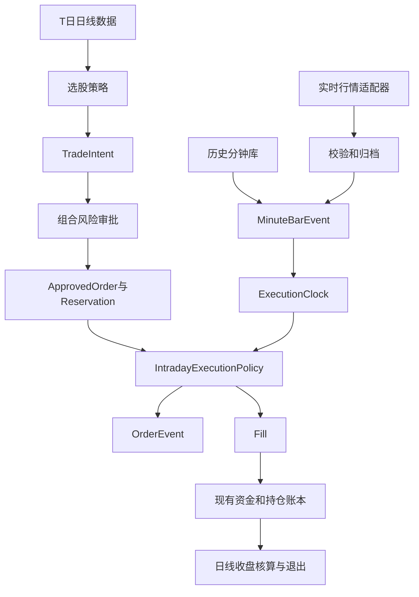

# 日线选股与分钟执行系统设计 v1

状态：设计草案

适用范围：VCP、Alpha158及其他使用 `TradeIntent -> Risk -> ApprovedOrder -> Fill`
订单链路的A股日线选股策略

当前运行边界：回测与实时影子盘，不连接券商，不发送证券委托

## 1 决策摘要

第一阶段采用“日线选股、分钟买入执行、日线退出与核算”的混合架构，
政策版本命名为 `hybrid_intraday_entry_v1`。

该版本只替换目前偏理想化的“次日开盘价一次性全部成交”假设，不改变：

- T日收盘后的选股结果和排名；
- `TradeIntent` 中的信号价格、初始止损和必需字段；
- 基于T日可见数据审批的订单数量、最高买价和风险预留；
- 日线收盘估值、跟踪止损更新和次日卖出逻辑。

第一阶段必须同时运行配对执行评估和独立组合回测。前者解释执行差异，
后者评估资金、持仓和后续风险审批分叉后的最终组合结果。

## 2 目标与非目标

### 2.1 目标

1. 将买入执行建模为可回放、可审计的盘中订单生命周期。
2. 让历史回放和实时影子盘共用同一套执行策略和原因码。
3. 显式建模Bar的时间区间、实际可得时间、数据延迟和修订。
4. 禁止盘中决策读取当日收盘价、全天成交量等未来信息。
5. 保持现有资金账、费用、价格限制、公司行为和风险预留语义。
6. 为第二阶段的盘中止损和部分成交留下明确扩展点。

### 2.2 非目标

第一阶段不实现：

- 分钟级选股、盘中横截面排名或新的Alpha因子；
- 盘中初始止损、跟踪止损或动态减仓；
- 部分成交、拆单、撤单重报或订单簿队列仿真；
- 券商网关、真实委托、撤单或成交回报；
- 对全市场持续拉取分钟数据；
- 长期分钟历史数据供应商的采购或授权。

## 3 现有系统和需要解决的缺口

现有VCP回测在T日生成 `TradeIntent`，风险引擎审批下一交易日有效的
`ApprovedOrder`，随后在T+1直接调用 `PortfolioExecutor.process_open()`。买单
使用 `panel.exec_open` 和固定滑点一次性全部成交。

分钟执行不能仅将 `exec_open` 替换为某根分钟Bar的开盘价，原因是：

- `process_open()` 还负责应收入账、卖单优先顺序、延期卖单和预留释放；
- `buy_tradable_mask` 依赖当日开盘、收盘和完整日成交量，不能在盘中使用；
- `ApprovedOrder.valid_session` 只表示交易日，无法表示09:35至10:30的盘中窗口；
- `Fill` 只记录日期，无法证明触发时间、参考Bar、数据来源和延迟；
- 当前分钟适配器在发起请求前写入 `received_at`，它不是真正的响应接收时间；
- 按请求区间过滤后数据为空时，当前适配器仍会将该请求标记为成功。

## 4 时间和数据可得性契约

### 4.1 时间字段

标准化的分钟Bar必须包含以下时间字段，全部使用 `Asia/Shanghai`：

| 字段 | 含义 |
| --- | --- |
| `source_timestamp` | 供应商原始时间标签 |
| `bar_start` | Bar所覆盖区间的开始时间 |
| `bar_end` | Bar所覆盖区间的结束时间 |
| `request_started_at` | 本地开始请求的时间 |
| `received_at` | 本地完整收到并解析响应的时间 |
| `available_at` | 本地首次观测到该Bar可用于决策的时间 |
| `provider_timestamp_semantics` | 供应商时间标签语义版本 |

`received_at` 必须在网络响应解析成功后获取，不得使用请求发起时间代替。
`available_at` 必须保留第一次可用时间，后续重新抓取不得覆盖。

### 4.2 供应商时间语义

每个供应商适配器必须单独声明时间标签是Bar开始、结束还是未知，
不得在通用层假设所有供应商都使用周期结束时间。

已有非交易时段样本显示，新浪A股分钟线使用周期结束标签：

- 1分钟首根标记为09:31；
- 5分钟首根标记为09:35；
- 09:35的5分钟Bar与09:31至09:35的1分钟Bar聚合一致。

该结论只确认历史标签语义，不证明09:35:00已经可在实时接口中获取该Bar。

### 4.3 历史数据的可得时间

历史回补数据没有真实 `available_at`，不得伪造为Bar结束时间。回放必须显式
选择延迟模型：

| 模型 | 语义 | 用途 |
| --- | --- | --- |
| `ideal_zero_delay` | 假设Bar结束时立即可用 | 仅用作乐观上界，不得作为主结果 |
| `fixed_delay` | `bar_end + configured_delay` | 尚无实测分布时的可重现敏感性分析 |
| `empirical_p50` | 使用实时归档的延迟中位数 | 延迟校准后的中性情景 |
| `empirical_p95` | 使用实时归档的延迟95分位数 | 悲观情景 |

在完成至少10个交易日的延迟归档前，所有分钟回测结果都必须同时报告
`fixed_delay` 的多个情景，不得只报告 `ideal_zero_delay`。

### 4.4 Bar完整性和修订

实时决策只能使用已完成Bar。完整性由供应商适配器根据其时间语义判定。

同一 `(symbol, interval, bar_end, source)` 后续数值变化时，必须作为新的 `revision`
追加保存。实时影子决策使用当时首次通过校验的版本；不得在回放时用
收盘后修订版覆盖当时可见版。

## 5 系统架构



回测和实时影子盘只替换 `ExecutionClock` 和数据来源：

- 历史回测使用 `MinuteReplayClock`；
- 实时影子盘使用 `WallClock`；
- 两者必须共用 `IntradayExecutionPolicy`、原因码、价格边界和预留语义。

## 6 分钟Bar数据契约

### 6.1 标准字段

`MinuteBarEvent` 至少包含：

```text
symbol
interval_minutes
source_timestamp
bar_start
bar_end
request_started_at
received_at
available_at
open_raw
high_raw
low_raw
close_raw
volume_shares
amount_raw
source
revision
is_complete
quality_codes
```

执行数据必须使用未复权价格，调用行情源时固定 `adjust=""`。复权数据只能用于
选股信号和研究特征，不得用于委托价格、涨跌停、费用或止损成交。

`amount_raw` 允许为空。M2容量限制使用 `volume_shares`，不得用零替代缺失的成交额。

### 6.2 强制校验

每根Bar进入存储或执行引擎前必须通过：

1. `low_raw <= open_raw, close_raw <= high_raw`；
2. OHLC为有限正数，成交量为非负数；
3. `bar_start < bar_end <= received_at`，实时数据不得来自未来；
4. 时间位于证券所对应的交易时段；
5. 同一版本内不存在重复主键；
6. 供应商切换后不使用新源覆盖已发生的实时决策输入；
7. 请求区间过滤后至少有一根目标Bar。

第7项失败时状态必须为 `NO_DATA`，不得将连接成功等同于数据可用。

### 6.3 健康状态

健康状态必须按证券和交易日跟踪，不得只依赖适配器级全局 `connected`：

```text
transport_ok
request_ok
data_present
coverage_ok
freshness_ok
schema_ok
latest_bar_end
latest_available_at
source
quality_codes
```

任一当日新买入必需状态为否时，订单必须保持等待或最终取消，不得使用旧Bar成交。

## 7 盘中可交易状态

`IntradayTradability` 必须与 `SelectionPanelV2.buy_tradable_mask` 分离。
在某个决策时刻，只允许使用：

- 该时刻前已知的上市、退市、板块和证券类型；
- 当日09:15前可得的ST、除权除息和价格限制参考记录；
- 当时已完成的分钟Bar和行情新鲜度；
- 当前是否位于允许的交易时段；
- 订单自身冻结的数量、最高买价和初始止损。

禁止使用：

- 当日日线收盘价、最高价、最低价或全天成交量；
- 收盘后才可知的停牌、数据覆盖或行情修订结果；
- 候选成交Bar尚未结束时的成交量、最高价和最低价。

行情缺失只表示 `UNKNOWN`，不得直接推断为停牌。`UNKNOWN` 对新买入必须失败关闭。

## 8 交易日生命周期

### 8.1 T日收盘后

1. 日线策略生成 `TradeIntent`。
2. 组合风险引擎使用T日可见数据计算数量。
3. 生成不可变的 `ApprovedOrder` 和 `Reservation`。
4. 单独生成 `IntradayExecutionInstruction`，它不改变选股意图和风险定仓。

### 8.2 T+1会话开始

1. 处理应收现金、送转股和其他已到账事件。
2. 按现有日线开盘政策处理卖出订单和延期卖单。
3. 保留当日买单和其全额资金、风险预留，不在09:30释放。
4. 若除权除息或价格限制参考价发生变化，第一阶段取消原买单并记录
   `CORPORATE_ACTION_REAPPROVAL_REQUIRED`，不在盘中自动重新定仓。

### 8.3 盘中买入窗口

提议默认值：

```text
trigger_bar_end       = 09:35:00
last_decision_at      = 10:29:00
last_candidate_start  = 10:30:00
full_fill_only        = true
```

09:35只是触发Bar的业务结束时间，不是默认可用时间。决策就绪时间为：

```text
decision_ready_at = available_at + decision_latency
execution_eligible_at = decision_ready_at + order_latency
```

回测候选价必须来自首个 `bar_start >= execution_eligible_at` 的1分钟Bar的
`open_raw`。如果某根1分钟Bar在决策就绪前已经开始，不得使用它的开盘价。

实时影子盘在没有快照或券商回报时，只能记录与回测相同的假设成交，
不得将事后获得的分钟开盘价表述为真实可成交价。

### 8.4 会话结束

1. 超过 `last_candidate_start` 仍未成交的买单取消。
2. 释放该订单的全部现金和风险预留。
3. 追加不可变的取消事件和原因码。
4. 日线引擎使用官方日线收盘数据执行估值、退出信号和止损发布。

## 9 订单和执行数据模型

### 9.1 IntradayExecutionInstruction

```text
instruction_id
order_id
policy_id
trigger_bar_end
last_decision_at
last_candidate_start
decision_latency_model_id
order_latency_model_id
full_fill_only
max_volume_participation
created_at
```

`ApprovedOrder` 继续保存业务订单的冻结结果；盘中窗口和延迟属于执行指令，
不应通过 `TradeIntent.metadata` 隐式传递。

### 9.2 OrderEvent

```text
event_id
event_at
order_id
instruction_id
event_type
remaining_quantity
reserved_cash
reference_bar_end
reference_source
reason_codes
details
```

建议事件类型：

```text
SESSION_STARTED
WAITING_TRIGGER_BAR
WAITING_DATA
DECISION_READY
WAITING_PRICE
WAITING_CAPACITY
WAITING_LIMIT_UNLOCK
FILLED
CANCELLED
EXPIRED
```

订单和预留保持不可变，当前状态由事件流重建。第一阶段不允许部分成交，
`remaining_quantity` 只能是原始数量或零。

### 9.3 Fill扩展字段

`Fill` 新增字段必须提供向后兼容的默认值：

```text
triggered_at
filled_at
reference_bar_start
reference_bar_end
reference_source
execution_policy_id
latency_model_id
data_latency_ms
participation_rate
fill_model_version
```

## 10 M1和M2买入执行规则

### 10.1 共同前置条件

每次评估必须按以下顺序执行：

1. 订单是当日有效的买单，且预留仍完整；
2. `IntradayTradability` 为可交易；
3. 触发Bar和候选价数据通过完整性、新鲜度和模式校验；
4. 候选价为有限正数；
5. `candidate_price_raw > initial_stop_raw`；
6. 滑点后价格不高于 `max_buy_price_raw` 和当日涨停价；
7. 订单数量不超过审批数量，不重新定仓。

滑点后价格计算与现有执行器保持一致：

```text
fill_price_raw = candidate_price_raw * (1 + slippage_bps / 10000)
```

当前价格超过最高买价时，订单进入 `WAITING_PRICE`，可在截止前重新评估；
当候选价不高于初始止损时，交易逻辑已失效，应立即取消。

### 10.2 M1规则

M1不施加额外分钟成交量限制。它仍受T日日线平均成交额容量和组合风险审批约束。
首个满足共同前置条件的候选价将整单成交。

### 10.3 M2规则

M2增加已完成Bar的成交量参与率限制：

```text
capacity_shares = floor(
    completed_reference_bar.volume_shares * max_volume_participation / 100
) * 100

max_volume_participation = 0.05
```

`completed_reference_bar` 必须在评估时刻之前已完成，不得使用候选成交Bar的
最终成交量。

v1 将 `completed_reference_bar` 冻结为 `decision_ready_at` 之前最近一根已完成的
1分钟Bar，并强制：

```text
capacity_reference_bar.bar_end <= decision_ready_at
candidate_bar.bar_start >= execution_eligible_at
capacity_reference_bar_id != candidate_bar_id
```

修改候选成交Bar的最终成交量不得改变此前已经产生的成交决定。

- `capacity_shares >= order.quantity`：允许整单成交；
- `capacity_shares < order.quantity`：写入 `WAITING_CAPACITY`，在下一完整Bar后重新评估；
- 到达截止时间仍不满足：整单取消，不部分成交。

### 10.4 涨停和流动性不确定性

基础模型使用以下规则：

- 候选价或滑点后价格等于或高于涨停价时，不成交并等待解锁；
- 候选Bar是涨停一字Bar时，不成交；
- Bar只是曾经触及涨停，但候选价低于涨停价时，基础模型允许成交。

同时输出悲观敏感性情景：候选Bar只要曾触及涨停，就视为不可成交。

## 11 资金预留和费用

1. T日审批后按 `max_buy_price_raw` 冻结的现金和风险一直保留到成交或取消。
2. 等待数据、价格、容量或涨停解锁不得释放预留。
3. 整单成交时按实际成交价和现有费用模型记账，然后释放剩余预留。
4. 整单取消时释放全部预留，但不删除 `ApprovedOrder`、`Reservation` 和 `OrderEvent`。
5. 第一阶段只有一笔Fill，因此保持现有最低佣金语义。

## 12 回测设计

### 12.1 D0 M1 M2实验

| 实验 | 成交模型 | 用途 |
| --- | --- | --- |
| D0 | 现有次日开盘一次性成交 | 冻结基线 |
| M1 | 09:35触发后的延迟感知分钟整单成交 | 隔离开盘延迟和价格边界的影响 |
| M2 | M1 + 5%已完成Bar成交量容量限制 | 评估盘中容量对成交率的影响 |

### 12.2 配对执行评估

从D0产生不可变的 `ApprovedOrderSnapshot`，D0、M1和M2对同一批订单独立评估，
不因任一分支的资金或持仓变化删除后续样本。

至少输出：

- 整体成交率、等待时长和取消原因；
- 成交价相对D0开盘价和T日收盘价的差异；
- 最高买价、容量、涨停和数据缺失导致的取消比例；
- 取消订单后1、5和20个交日的机会成本；
- 不同延迟情景的成交价和成交率差异。

### 12.3 独立组合回测

D0、M1和M2各自维护资金、持仓、预留和后续风险审批。输出现有组合指标，
并增加：

- 路径分叉开始日期；
- 因未成交保留的现金和因后续风险预算产生的影响；
- 成交数、取消数、暴露率、收益、回撤、换手和压力损失；
- 按年份、板块、流动性分组和延迟模型拆分的结果。

### 12.4 防未来函数规则

1. 第N根Bar的信息只能在其 `available_at` 之后产生决策。
2. 候选成交Bar必须在 `execution_eligible_at` 之后开始。
3. M2不得使用候选成交Bar的最终成交量。
4. 改动决策时刻之后的日线收盘、全天成交量和未来分钟Bar，不得改变已产生的决策。
5. 历史最终修订版和实时首见版必须明确区分。

## 13 实时影子盘

### 13.1 订阅范围

每日只请求：

- 当日待执行买单；
- 已有持仓，用于数据归档和第二阶段准备；
- 基准指数，用于数据完整性和市场会话校验。

不得因为接入分钟数据就对全市场高频轮询。

### 13.2 运行步骤

1. 09:25载入当日订单、预留和价格限制参考。
2. 09:30启动会话、入账事件并处理已有卖单。
3. 按配置轮询1分钟数据，同时归桤原始响应和标准化Bar。
4. 只在新的完整Bar或健康状态变化时驱动执行政策。
5. 记录假设委托、等待、假设成交或取消事件。
6. 10:30后不再产生新买入成交。
7. 收盘后使用日线数据完成账本和退出引擎。

### 13.3 失败关闭

以下任一情况禁止新买入：

- 时钟偏差、时区或交易日无法确认；
- 请求成功但目标时段数据为空；
- Bar延迟超过配置阈值；
- OHLCV校验失败、重复冲突或供应商时间语义未知；
- 价格限制参考或当日证券状态未知；
- 订单、预留或当前持仓无法完整恢复。

数据源故障时不得使用最后一根旧Bar假设成交。失败应保留订单和预留到
截止时间，最终写入取消原因。

## 14 数据存储和重放

建议逻辑分区：

```text
minute_bars/
  source=<provider>/
    interval=<minutes>/
      trade_date=<YYYYMMDD>/
        symbol=<exchange_code>/
          bars.parquet
          manifest.json
```

`manifest.json` 至少记录：

```text
schema_version
source
symbol
trade_date
interval_minutes
request_count
first_request_started_at
last_received_at
earliest_bar_end
latest_bar_end
row_count
revision_count
quality_codes
content_sha256
```

写入必须是原子的，并按 `(symbol, interval, bar_end, source, revision)` 去重。
回放默认只读取在对应 `available_at` 前已经可见的版本。

当前新浪接口单次最多返回约1,970条，不属于长期历史库。实时归档从启用日开始
只能支持向后累积的回放；多年分钟回测需要另外的合法授权数据源。

## 15 代码集成设计

### 15.1 市场数据层

`abupy/MarketBu/ABuRealtimeMarket.py`：

- 在响应解析后生成 `received_at`；
- 将供应商时间标签转换为 `bar_start` 和 `bar_end`；
- 区分运输成功、数据存在、数据新鲜和覆盖完整；
- 过滤后结果为空时返回 `NO_DATA`；
- 保留原始供应商响应的可选归档接口。

新增 `abupy/MarketBu/ABuMinuteBarStore.py`：

- `append(events)`；
- `read(symbol, trade_date, interval, as_of=None)`；
- `health(symbol, trade_date, as_of)`；
- `reconcile_daily(symbol, trade_date, daily_bar)`。

### 15.2 执行层

新增 `abupy/AlphaBu/ABuIntradayExecution.py`：

- `IntradayExecutionInstruction`；
- `OrderEvent`；
- `IntradayTradability`；
- `IntradayExecutionPolicy`；
- `M1ExecutionPolicy` 和 `M2ExecutionPolicy`。

新增 `abupy/AlphaBu/ABuMinuteReplay.py`：

- `ExecutionClock`；
- `MinuteReplayClock`；
- `WallClock`；
- 延迟模型和决策事件排序。

修改 `abupy/AlphaBu/ABuPortfolioExecutor.py`：

- 将会话开始账务事件与开盘成交分离；
- 保留卖单优先顺序和延期语义；
- 抽取共用的费用、限价、资金和持仓入账函数；
- 接受盘中Fill，但不复制一套独立账本。

修改 `abupy/AlphaBu/ABuTradeIntent.py`：

- 添加执行指令和订单事件记录；
- 向后兼容地扩展 `Fill`；
- 第二阶段再增加 `PositionLot` 和可卖数量。

### 15.3 策略和运行器

`run_vcp_backtest()` 增加可选执行政策，默认仍为D0。日线选股和风险审批
不得根据D0、M1或M2分支产生不同的T日订单。

新增实时影子盘运行器，只读取冻结订单和分钟行情，不连接券商。

## 16 审计输出和原因码

每次回测和影子运行至少导出：

```text
approved_orders.parquet
execution_instructions.parquet
order_events.parquet
fills.parquet
minute_data_health.parquet
minute_data_manifest.json
execution_manifest.json
paired_execution_metrics.json
portfolio_metrics.json
```

必需原因码至少包含：

```text
NO_DATA
STALE_DATA
INVALID_BAR
UNKNOWN_TRADABILITY
CORPORATE_ACTION_REAPPROVAL_REQUIRED
BELOW_INITIAL_STOP
ABOVE_MAX_BUY_PRICE
SLIPPAGE_EXCEEDS_MAX_PRICE
AT_LIMIT_UP
LOCKED_LIMIT_UP
INSUFFICIENT_COMPLETED_BAR_CAPACITY
EXECUTION_WINDOW_EXPIRED
RESERVATION_MISSING
```

## 17 分阶段实施

### 17.1 阶段A 数据契约和归档

- 修正 `received_at` 和空结果健康状态；
- 实现供应商时间语义、`MinuteBarEvent` 和 `MinuteBarStore`；
- 开始归档候选股、持仓和基准的1分钟数据；
- 连续记录至少10个交易日的 `available_at - bar_end` 延迟。

### 17.2 阶段B 配对执行回放

- 抽取会话开始、卖单和买单执行边界；
- 实现 `OrderEvent`、M1和M2；
- 对同一批冻结订单运行D0、M1和M2配对评估；
- 只输出执行质量，不允许用结果反向修改选股阈值。

### 17.3 阶段C 独立组合回测

- D0、M1和M2分别维护资金、持仓和风险状态；
- 评估路径分叉后的收益、回撤、成交率和容量；
- 冻结主结果和延迟敏感性结果。

### 17.4 阶段D 实时影子盘

- 连续运行至少20个交易日；
- 对比实际首见Bar、收盘后最终Bar和回放决策；
- 记录数据源切换、缺失、延迟和修订；
- 仍然不发送真实订单。

### 17.5 阶段E 盘中止损研究

只有在阶段D验收后才能开始，且必须单独版本化：

- 初始止损触发Bar和下一可成交价模型；
- 普通A股T+1与可回转证券的 `settlement_profile`；
- `PositionLot`、`sellable_from_session` 和 `sellable_quantity`；
- 盘中止损与日线跟踪止损的优先级。

## 18 验收标准

### 18.1 回归兼容

- D0默认路径的现有回测输出与重构前一致；
- 现有单元测试全部通过；
- 旧版模拟盘状态能读取，或提供显式、可审计的一次性迁移。

### 18.2 时间和防未来函数

- 任何Fill的候选Bar开始时间不早于 `execution_eligible_at`；
- 修改决策后的日线收盘、全天成交量或未来Bar，不改变已生成事件；
- M2只使用评估时刻前完成的Bar容量；
- 历史数据缺少 `available_at` 时必须选择延迟模型，不允许默认零延迟。

### 18.3 订单和预留

- 等待数据、价格或容量时预留不变；
- 成交或取消后预留恰好释放一次；
- 任何订单都能由 `ApprovedOrder + Reservation + OrderEvent + Fill` 重建完整路径；
- 第一阶段不存在部分成交或多笔Fill。

### 18.4 数据失败行为

- 空数据、过期数据、未知交易状态和校验失败均不产生新买入；
- 数据源失败不使用旧Bar或日线开盘价自动降级成交；
- 每次失败均有稳定原因码，且不会重复释放预留。

### 18.5 评估完整性

- D0、M1和M2配对评估使用完全相同的冻结订单集；
- 独立组合回测明确报告路径已分叉，不将后续订单数差异解释为单笔执行效果；
- 所有主结果同时报告至少一个悲观延迟或涨停流动性情景。

### 18.6 实时影子盘准入

先使用至少10个有效交易日校准并冻结有效日定义、窗口覆盖率、新鲜完整Bar
可用率、p95/p99延迟、陈旧率、切源率、重复事件率和恢复成功率阈值。阈值
冻结后，重新开始连续至少20个有效交易日的准入观察，并满足：

- 无未来Bar、重复Fill、超出有效窗口的Fill或预留负数；
- 所有待执行证券均有独立数据健康记录；
- 可重启恢复，重放后不产生额外订单或Fill；
- 已归档延迟分布，可生成 `empirical_p50` 和 `empirical_p95` 模型；
- 数据缺失和降级率已报告，且所有异常均失败关闭。

有效交易日至少需要覆盖完整执行窗口、为全部待执行证券生成独立健康记录、
完成原始与标准事件归档及日终审计。策略规则、数据契约或准入阈值改变后，
20日观察窗口重新连续计时。

## 19 待冻结配置

以下为提议默认值，必须在首次正式配对实验前冻结并计算配置哈希：

```text
policy_id                  = hybrid_intraday_entry_v1
trigger_bar_end            = 09:35:00
last_decision_at           = 10:29:00
last_candidate_start       = 10:30:00
slippage_bps               = 25
full_fill_only             = true
m2_max_volume_participation = 0.05
stale_after_seconds        = 待盘中延迟实测后冻结
fixed_delay_scenarios      = 待阶段A预注册
```

待确认的主要决策：

1. 历史分钟数据的授权数据源和可回溯年限；
2. `fixed_delay` 的预注册秒数；
3. 实时轮询频率、单次请求超时和全局限流；
4. 除权除息日是一律取消，还是支持基于事前参考价的重审批；
5. 悲观触涨停流动性情景是敏感性输出，还是主执行模型。

## 20 外部依据

- [AKShare A股分时数据接口说明](https://github.com/akfamily/akshare/blob/main/docs/data/stock/stock.md)
- [上海证券交易所2026年交易规则](https://www.sse.com.cn/lawandrules/sselawsrules2025/trade/universal/c/c_20260424_10816492.shtml)
- [深圳证券交易所2026年交易规则](https://docs.static.szse.cn/www/lawrules/rule/trade/current/W020260424690713155663.pdf)
