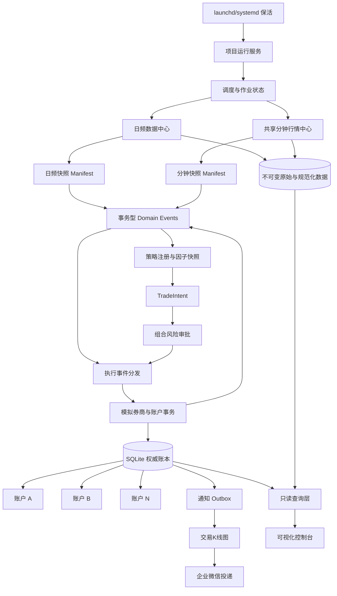
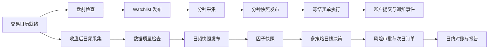

# 自闭环多策略模拟交易系统设计 v1

状态：M0 输入草案；完成本规格定义的 schema、状态机和故障测试评审后方可冻结

适用范围：A股日线选股、分钟级买入执行研究、多策略模拟账户、数据归档、
可视化和企业微信通知。

当前运行边界：研究、回测、实时影子盘和模拟盘；不连接券商，不发送真实证券委托。

## 1. 决策摘要

本系统在现有研究、行情、风险和模拟资金账能力之上增加统一运行服务层，形成：

```text
自动采集 -> 数据校验与版本发布 -> 策略决策 -> 风险审批 -> 模拟执行
         -> 账户对账 -> 可视化 -> 企业微信通知 -> 运行审计
```

v1 采用以下强制决策：

1. 业务调度由项目内常驻服务负责，不依赖 Codex 自动任务；操作系统服务只负责
   启动、保活和异常重启。
2. 日频和分钟行情统一采集一次，多策略通过不可变快照共享，策略不得直接调用行情源。
3. 每个模拟账户拥有独立、稳定的 `account_id`；策略定义、部署实例、配置版本和
   资金账户是不同身份。
4. SQLite WAL 中的账户账本、输入事件消费记录和通知 outbox 是权威运行状态；
   JSON、CSV、HTML 和图表是可重建派生物。
5. 每个账户的账户变更、订单、成交、风险决策、事件消费记录和 outbox 必须在
   同一个数据库事务中提交。
6. 快照提交和对应 `domain_event` 必须在同一个 SQLite 事务中创建；分发器只消费
   持久化事件，不在事务提交后临时“发送一次”。
7. 分钟行情必须先发布跨证券快照 manifest；快照固定决策截止时间、选定 Bar revision、
   前驱和单调序号。账户只增量消费快照，不得重新读取分区 `CURRENT` 或重算历史状态。
8. v1 保持 `hybrid_intraday_entry_v1` 的既有语义：日线选股、分钟买入执行、
   日线退出与核算。盘中止损、盘中卖出、动态加仓和减仓不在 v1 准入范围。
9. 必需因子缺失时失败关闭；可选因子的降级公式必须预先定义并版本化。
10. 本地交易事件和 outbox 可以保证事务内只提交一次；企业微信采用持久化重试、
    允许重复，直至确认成功或由人工明确终止，不承诺外部端恰好一次或必然送达。
11. 调度入口迁移和分钟执行政策准入使用不同门禁。分钟政策继续继承现有
    `10 个有效交易日校准 + 冻结后连续 20 个有效交易日观察` 的要求。
12. 账户使用最小交易日阶段状态机；未完成盘前输入、应收和开盘卖出时，分钟买入只能
    归档等待，不能成交。
13. 调度迁移按 `job_id` 逐项切换。首次新系统账户事件提交后禁止恢复旧账户快照，只能
    向前修复或迁移最新权威状态。

## 2. 目标与非目标

### 2.1 目标

1. 项目可以在没有 Codex 参与的情况下持续运行、重启恢复和每日对账。
2. 自动增量获取指数、行业、个股、日K、估值、公司行为和可用的 PIT 基本面数据。
3. 自动积累未复权成交行情、复权信号行情和分钟行情，并保留来源、可得时间和修订。
4. 支持多个独立模拟账户运行相同或不同策略，共享同一行情快照和交易日历。
5. 将选股、风险审批、订单、成交、持仓、拒绝原因和行情输入串成可审计链路。
6. 提供只读的系统健康、数据覆盖、市场、个股和多账户绩效视图。
7. 将成交操作、原因和对应K线图通过企业微信异步推送。
8. 数据缺失、进程中断或供应商异常时安全失败，不猜测数据、不重复下单。
9. 历史回放与实时影子运行尽量复用相同的数据契约、执行政策和原因码。

### 2.2 非目标

v1 不实现：

- 券商连接、真实委托、撤单或成交回报；
- 自动修改策略参数、根据近期盈亏自动调参或自动晋级策略；
- 分钟级选股、盘中横截面排名或新的 Alpha 因子；
- 盘中初始止损、跟踪止损、动态加仓、减仓或盘中卖出；
- 部分成交、订单簿排队、拆单或撤单重报；
- 对全部 A 股持续获取分钟行情；
- 跨机器高可用、分布式事务或多主写入；
- 用当前可见的历史修订财报回填为历史 PIT 事实。

以上非目标可以在独立版本中研究，但不得通过配置开关绕过 v1 门禁。

## 3. 已有能力与复用边界

### 3.1 可复用模块

| 能力 | 现有模块 | v1 使用方式 |
| --- | --- | --- |
| 日频研究面板 | `ABuSelectionPanelV2` | 作为数据和因子快照构建基础 |
| PIT 基本面 | `ABuFundamentalPIT` | 保留来源、可得时间和覆盖门禁 |
| 行业强度 | `ABuIndustryStrength` | 作为版本化因子输入 |
| 实时与分钟适配 | `ABuRealtimeMarket` | 由统一行情中心调用，策略不得直连 |
| 分钟分区存储 | `ABuMinuteBarStore` | 保存不可变分区；上层新增跨证券快照 |
| 分钟买入状态机 | `ABuIntradayExecution` | 保持冻结的 v1 买入执行语义 |
| 组合风险 | `ABuPortfolioRisk` | 继续审批交易意图和风险预留 |
| 模拟资金账 | `ABuPortfolioExecutor` | 作为纯领域计算核心，不再单独承担持久化事务 |
| 交易契约 | `ABuTradeIntent` | 扩展账户和策略实例命名空间 |
| VCP 模拟盘 | `ABuVCPPaperTrading` | 通过适配器接入，并建立结果复现基线 |
| Alpha158 shadow | `ABuAlphaForwardShadow` | 通过适配器接入独立 shadow 账户 |
| 企业微信队列 | `queue_wecom_strategy.py` | 迁移为事务 outbox 的投递工作器 |
| 可视化 | `ABuTradeVisualization` | 先生成派生图表和静态页面 |

### 3.2 不直接视为持续运行能力

以下能力虽然已有代码，但必须经过服务化改造后才能用于统一运行：

- `PortfolioExecutor` 的内存状态不是事务型账户数据库；
- 单个分钟分区原子提交不代表一轮 watchlist 行情原子发布；
- 单脚本文件锁不代表全系统单写者；
- 文件名去重不代表企业微信端恰好一次投递；
- 历史回测可用不代表实时延迟、覆盖率和修订满足分钟执行门禁；
- 某个采集脚本成功不代表依赖它的因子快照已经完整可用。

## 4. 系统架构



### 4.1 进程模型

v1 是单机、单服务实例、单数据库写入者模型：

- 一个常驻主进程维护调度器和服务生命周期；
- 数据采集可以并发执行网络 I/O，但数据发布必须按快照串行提交；
- 每个账户拥有串行事件队列；不同账户可以计算并行，但数据库写入由单一写入路径完成；
- 通知工作器和可视化渲染器不得直接修改账户状态；
- 主服务全生命周期持有本机 OS 排他文件锁，第二个实例无法取得锁时立即退出；
- 取得文件锁后生成 `service_instance_id` 并写入数据库，供作业和审计引用；
- v1 不使用可过期数据库租约承担互斥。未来跨机器版本若使用租约，必须增加单调
  `fencing_token`，并在每个写事务中校验。

v1 不通过启动多个主服务实例提升吞吐。确有需要时另行设计分布式版本。

## 5. 身份和版本契约

### 5.1 身份定义

| 字段 | 含义 | 稳定性 |
| --- | --- | --- |
| `strategy_id` | 策略类型，如 `vcp` | 跨版本稳定 |
| `strategy_version` | 策略规则版本 | 规则改变时变化 |
| `strategy_instance_id` | 一个长期运行的部署实例 | 创建后不可改变 |
| `account_id` | 独立资金和持仓账本 | 创建后不可改变 |
| `activation_id` | 某次配置生效记录 | 每次配置切换新建 |
| `config_hash` | 规范化配置内容哈希 | 配置改变时变化 |
| `policy_id` | 执行或风险政策名称 | 政策语义改变时变化 |
| `policy_version` | 政策版本 | 政策语义改变时变化 |

### 5.2 绑定规则

1. `account_id` 不得由 `config_hash` 推导。
2. 一个账户同一时刻只能绑定一个用于新决策和新开仓的有效 `strategy_instance_id`
   和 `activation_id`；未平仓逻辑交易可以继续使用各自冻结的管理 activation。
3. 配置升级默认保留 `account_id`，通过新的 `activation_id` 定义生效交易日边界。
4. 同一策略和相同配置可以创建多个实例和多个账户，它们必须拥有不同身份。
5. 已有持仓继续归属原账户；配置升级不得通过更换身份使旧持仓失去管理策略。
   每笔逻辑交易必须保存自己的开仓和管理 activation、退出政策及版本。
6. 订单、成交、消费记录和通知的存储唯一键必须包含 `account_id`，或者使用
   全局随机且不可碰撞的 ID；即使使用全局 ID，仍必须显式存储 `account_id`。

### 5.3 配置切换

配置切换只允许在预先声明的交易日边界生效：

```text
activation_id
strategy_instance_id
account_id
config_hash
effective_from_session
effective_until_session
previous_activation_id
change_reason
approved_at
```

有未平仓持仓时，配置升级必须明确旧持仓使用旧政策继续管理，还是由新政策接管。
该选择不能只写在账户激活记录中。每笔逻辑交易或持仓 lot 至少保存：

```text
trade_id
opened_under_activation_id
management_activation_id
entry_policy_id
entry_policy_version
exit_policy_id
exit_policy_version
risk_policy_id
risk_policy_version
```

旧持仓默认保留原 `management_activation_id`。新 activation 接管旧持仓时，必须逐笔
产生不可变 `PositionManagementTakenOver` 事件，记录旧、新 activation、政策版本、
生效时间和批准原因。底层不得把采用不同管理政策的 lot 合并成无法还原的单一持仓；
页面可以展示聚合值，但权威账本必须保留逻辑交易和 lot 归属。

## 6. 权威状态和持久化

### 6.1 权威数据分类

| 数据 | 权威存储 | 说明 |
| --- | --- | --- |
| 原始行情和供应商响应 | 不可变文件 | 内容寻址、保留来源与抓取时间 |
| 规范化日线和分钟分区 | 不可变文件 | 允许追加修订，不覆盖旧版 |
| 行情快照 manifest | 不可变文件 + SQLite 目录记录 | SQLite 只发布已验证 manifest |
| 内部领域事件和消费进度 | SQLite | 快照提交与事件创建同事务；消费者持久化进度 |
| 作业运行状态 | SQLite | 幂等键、尝试次数、错误和依赖 |
| 账户、订单、成交和持仓 | SQLite | 权威交易状态 |
| 输入事件消费进度 | SQLite | 与账户变更同事务提交 |
| 通知 outbox | SQLite | 与交易事件同事务创建 |
| CSV、JSON、HTML、PNG | 派生文件 | 可从权威状态重新生成 |

### 6.2 文件与数据库发布顺序

文件系统和 SQLite 之间不实现分布式事务，采用“先写不可变内容，后发布引用”：

1. 在目标目录所在的同一文件系统写入临时文件；
2. 完整校验内容；
3. flush 并 `fsync` 临时文件；
4. 原子 rename/replace 为内容寻址文件，再 `fsync` 父目录；
5. 构建并校验 manifest，以同样的文件和父目录持久化规则原子落盘；
6. 在同一个 SQLite 事务中将该 `snapshot_id` 标记为 `COMMITTED`，并插入对应的
   `domain_events` 记录或确定性下游作业；
7. 事务提交后，分发器扫描持久化事件并交给下游消费者；分发不是发布事务的一部分。

第 6 步之前产生的文件属于安全孤儿，可以由清理任务识别，但不得被策略读取。
SQLite 中只允许引用已经存在且哈希校验通过的 manifest。启动审计发现引用文件缺失时，
相关快照转为 `CORRUPT`，所有依赖决策失败关闭。

进程在第 6 步提交后、第 7 步分发前退出时，重启后的分发器必须从未消费的
`domain_events` 恢复；不得依赖重新构造或“再发布一次”内存事件。

### 6.3 SQLite 运行要求

- 开启 WAL、外键和 busy timeout；
- 所有时间以带时区的 ISO 8601 保存，业务时区为 `Asia/Shanghai`；
- 金额、价格和数量的精度规则必须在 schema 中固定；
- schema 迁移有单调递增版本，不允许启动时静默修改生产表；
- SQLite WAL 数据库使用 SQLite Online Backup API 或经验证的 `VACUUM INTO` 备份，
  禁止只复制主 `.db` 文件；
- 数据库备份和其引用的不可变文件生成统一 backup manifest，记录 schema 版本、
  数据库哈希和必需文件/manifest 哈希；
- 每日备份数据库和未被其他介质覆盖的不可变数据，并定期执行完整恢复演练；
- 可视化查询使用只读连接，不取得写锁。

## 7. 事件契约

### 7.1 统一事件 envelope

所有进入策略或账户处理器的事件至少包含：

```text
event_id
event_type
schema_version
stream_id
sequence_no
previous_event_id
occurred_at
available_at
trading_session
source_service
snapshot_id
causation_id
correlation_id
payload_sha256
payload
```

账户相关事件还必须包含：

```text
account_id
actor_strategy_instance_id          # 可空；发起本次新决策的策略实例
actor_activation_id                 # 可空；发起本次新决策的 activation
affected_trade_ids                  # 可空集合
affected_management_activation_ids  # 可空集合
```

账户估值、公司行为、对账等系统事件可以没有 actor activation。作用于具体逻辑交易的
策略管理事件必须在 payload 中保存 `trade_id`、`management_activation_id` 和实际使用的
政策版本。批量账户事件可以通过 `affected_*` 集合审计，也可以拆成同一 correlation 下的
逐交易事件；不得用一个含义不明的账户级 `activation_id` 代表多个持仓管理版本。

### 7.2 幂等规则

1. `event_id` 标识一个不可变事实，重试不得产生新的 `event_id`。
2. 同一账户通过唯一键 `(account_id, event_id)` 记录消费结果。
3. 已成功消费的事件再次到达时直接返回既有结果，不再次改变账户。
4. 失败且未提交的事件可以使用同一 `event_id` 重试。
5. 事件内容与既有 `event_id` 的 `payload_sha256` 不同属于数据损坏，必须报警并停止。
6. 每个有序事件流使用 `(stream_id, sequence_no)` 形成唯一、单调顺序；消费者只在
   前驱已经成功处理或根据冻结政策明确越过 gap 后推进水位线。
7. 交易日、可得时间、事件类型优先级和事件 ID 只用于同一已就绪批次内的确定性排序，
   不能替代流序号和水位线。

### 7.3 领域事件 outbox

`domain_events` 是服务内部事实分发的权威来源，与面向企业微信的
`notification_outbox` 分离。至少保存：

```text
event_id
stream_id
sequence_no
previous_event_id
event_type
payload_sha256
payload
created_at
source_transaction_id
```

消费者通过 `event_consumptions(consumer_id, event_id)` 和流级水位线记录处理结果。
快照 `COMMITTED`、账户成交等需要驱动下游的事实，必须在产生事实的同一数据库事务中
插入 `domain_events`。分发器可以重复投递，但不能删除尚未被所有必需消费者确认的事件。

v1 使用最小消费者登记表 `event_consumers`：

```text
consumer_id
required
effective_from_stream
effective_from_sequence
retired_at
retired_after_sequence
retention_class
```

新消费者只从登记的生效序号开始参与确认，除非显式申请历史 replay。必需消费者退休前
必须确认到 `retired_after_sequence`，或由人工批准并记录未消费范围；非必需消费者不能
阻止事件归档。v1 不自动删除在线 `domain_events`，只允许在全部必需消费者确认、备份
校验通过后，由审计工具执行人工归档。

### 7.4 水位线、gap 和迟到事件

有序流至少包括：

```text
market-daily:{trading_session}
market-minute:{trading_session}:{interval_minutes}
account:{account_id}
corporate-action:{symbol}
notification:{account_id}
```

每个消费者必须保存 `last_consumed_sequence`。发现 `sequence_no > last + 1` 时进入
`WAITING_FOR_GAP`，等待时间和越过政策由流类型的版本化配置决定。达到期限后：

- 分钟行情流缺序号：冻结相关订单并告警，不得自行越过后成交；
- 日频或公司行为流缺序号：阻断相关交易日或证券的自动决策；
- 通知流缺序号：允许其他账户继续，但本流保持等待并告警；
- 只有显式允许越过的非交易关键流可以写入 `StreamGapAccepted` 后推进水位线。

迟到事件定义为 `sequence_no <= last_consumed_sequence` 但此前未消费的事件。处理规则：

| 迟到事实 | 行为 |
| --- | --- |
| 已成交前序分钟 Bar 修订 | 记录审计和数据质量事件，不改写交易事实 |
| 普通行情质量标记 | 记录审计并影响后续准入统计 |
| 公司行为或证券状态 | 阻断相关账户/证券，进入显式更正和人工复核流程 |
| 重复且内容相同的事件 | 幂等忽略 |
| 相同 ID 但内容不同 | 数据损坏，停止对应流 |

已经产生的订单、成交和账户事件不得通过重新排序或重跑历史状态机静默改写；修正必须
使用显式更正事件，并保留原事实。

## 8. 行情快照契约

### 8.1 日频快照

日频快照至少记录：

```text
snapshot_id
trading_session
decision_cutoff
created_at
universe_version
calendar_version
security_master_version
raw_price_version
adjusted_price_version
industry_version
valuation_version
fundamental_pit_version
corporate_action_version
limit_reference_version
required_components
missing_components
quality_codes
manifest_sha256
```

只有所有必需组件完成且通过质量门禁时，状态才能由 `BUILDING` 变为 `COMMITTED`。
策略只能消费 `COMMITTED` 快照。

### 8.2 分钟跨证券快照

`MinuteBarStore` 继续按证券、供应商、交易日和周期保存分区版本；其上增加
跨证券批次 manifest：

```text
snapshot_id
stream_id
sequence_no
previous_snapshot_id
trading_session
interval_minutes
watchlist_id
watchlist_version
decision_cutoff
collection_started_at
collection_completed_at
provider_policy_version
bar_selection_policy_version
symbol -> partition_manifest_sha256
symbol -> selected_bar_set_sha256
symbol -> selected business_bar_key/revision/event_id
symbol -> terminal_status
symbol -> latest_available_at
missing_symbols
stale_symbols
quality_codes
manifest_sha256
```

终止状态至少包括：

```text
AVAILABLE
NO_DATA
STALE
PROVIDER_ERROR
SCHEMA_ERROR
NOT_TRADING
SUSPENSION_UNKNOWN
```

快照发布要求：

1. watchlist 中每个证券必须有明确终止状态；
2. 每个可用证券固定分区 manifest 哈希，不能只保存 `CURRENT` 路径；
3. 选定记录必须满足 `available_at <= decision_cutoff`；每个业务 Bar 在候选记录中按
   冻结的 `bar_selection_policy_version` 选择唯一 revision；
4. v1 默认选择算法是：在固定分区 manifest 内过滤可得时间后，对每个
   `business_bar_key` 选择 revision 最大的记录，并将选定 event ID 集合计算为
   `selected_bar_set_sha256`；
5. 策略和执行器按快照内选定集合读取，不得重新解析最新修订或分区 `CURRENT`；
6. v1 的分钟流固定为 `market-minute:{trading_session}:{interval_minutes}`，不得把
   `watchlist_id` 放入 stream ID；同一流的快照具有连续 `sequence_no` 和
   `previous_snapshot_id`，不得倒退或分叉；
7. 后续修订产生新快照，不改变既有快照；已经消费的业务 Bar 修订只形成审计输入，
   不重新驱动已发生的订单状态转换；
8. 账户持久化 `last_consumed_minute_sequence` 和订单执行状态，每次只处理新增、连续快照，
   禁止每轮读取全部分钟数据后从头重算历史状态机；
9. 某证券缺失是否阻断由策略的必需输入契约决定，不能由行情中心擅自填补；
10. 分钟快照没有完整发布时，不产生执行事件。

若逐 Bar 选择列表被拆分为单独内容寻址文件，主 manifest 必须保存其路径、SHA256 和
记录数。仅保存选择算法而不保存选定集合哈希，不能满足实时决策审计要求。

### 8.3 动态 watchlist

分钟 watchlist 是以下集合的去重并集：

- 所有启用账户的持仓；
- 所有有效待执行订单；
- 当日已冻结的选股候选；
- 策略声明的指数和行业代理；
- 为数据质量校准配置的哨兵证券。

每次集合变化生成新的 `watchlist_id` 和单调递增 `watchlist_version`，但不切换当日分钟
stream。变化后的第一张快照继续引用变化前最后一张快照作为 `previous_snapshot_id`。
新增证券只从加入 watchlist 后参与采集，删除证券不改变既有快照，也不能移除仍有持仓、
有效订单或未终结执行状态的证券。v1 不持续拉取全市场分钟行情。

## 9. 日频数据和因子契约

### 9.1 数据层级

```text
供应商原始响应
-> 规范化事实
-> PIT 与可得时间处理
-> 数据质量检查
-> 日频快照
-> 策略因子快照
```

每一层都必须保存上游版本引用，不允许策略直接从供应商响应临时拼接因子。

### 9.2 基本面和估值

PE 等估值数据可以来自：

1. 数据源在当日提供的估值快照；或
2. 当日未复权价格和当时已公开的 PIT TTM 盈利计算结果。

必须记录：

```text
value
unit
calculation_version
price_snapshot_id
fundamental_fact_ids
available_at
source
quality_codes
```

前瞻运行可以从首次成功归档日起积累结构化快照。历史 PIT 覆盖不足时，涉及该字段的
历史回测必须失败关闭或明确标记为不可用，不能使用今天看到的修订财报回填。

### 9.3 必需和可选字段

每个策略版本必须声明：

```text
required_fields
optional_fields
display_only_fields
degradation_policy_version
```

规则如下：

- 必需字段缺失：该证券或本次策略运行失败关闭；
- 可选字段缺失：只有存在冻结的降级公式时才允许继续；
- 展示字段缺失：不影响决策，但必须在报告中标记；
- 缺失值不得填零、沿用未来值或临时关闭过滤条件；
- 决策记录必须保存 `actual_factor_set` 和降级原因。

## 10. 策略和账户接口

### 10.1 策略插件职责

策略插件只负责：

- 声明数据依赖；
- 根据已提交日频快照产生候选和 `TradeIntent`；
- 给出信号强度、初始止损、策略原因和必需字段使用情况；
- 声明下一交易日需要监控的证券；
- 按既有日线规则产生退出意图。

策略不得：

- 直接调用外部行情接口；
- 修改账户现金、持仓或订单；
- 自行发送企业微信；
- 读取未提交快照或其他账户私有状态；
- 在运行时更改自己的配置或因子集合。

### 10.2 接口草案

```python
class StrategyPlugin:
    strategy_id: str
    strategy_version: str

    def data_requirements(self) -> DataRequirements:
        ...

    def build_watchlist(self, daily_snapshot, account_view) -> WatchlistRequest:
        ...

    def on_daily_close(self, daily_snapshot, account_view) -> list[TradeIntent]:
        ...

    def explain(self, intent) -> DecisionExplanation:
        ...
```

v1 不定义策略级 `on_minute_bar()` 决策接口。分钟数据由冻结的执行政策消费，避免
策略借此引入未准入的盘中 Alpha、止损或加减仓逻辑。

### 10.3 原因记录

每个意图和风险决策同时保存结构化原因与可读说明：

```text
reason_code
reason_text
factor_snapshot_id
factor_values
thresholds
actual_factor_set
risk_decision_id
source_snapshot_id
policy_id
policy_version
```

可读说明只用于展示；结构化字段是回放和统计的权威依据。

## 11. 组合风险和模拟执行

### 11.1 v1 执行语义

v1 固定为：

```text
T 日收盘后：
  日频快照 -> 选股 -> TradeIntent -> 风险审批
  -> ApprovedOrder + Reservation

T+1 交易日：
  按既有日线政策处理卖出、应收和公司行为
  -> 冻结买单进入 hybrid_intraday_entry_v1
  -> 使用已发布分钟快照判断买入成交或过期

T+1 收盘后：
  日线估值 -> 更新退出状态 -> 生成后续日线退出意图
```

以下行为在 v1 中禁止：

- 使用未完成分钟 Bar；
- 分钟 Bar 触发新的选股或风险定仓；
- 分钟止损和盘中卖出；
- 动态加仓、减仓和部分成交；
- 使用当日日线收盘价、全天最高价或全天成交量完成盘中决策；
- 以收盘后修订的分钟数据改写实时成交结果。

### 11.2 账户交易日阶段屏障

作业 DAG 只负责调度，不能作为账户成交的正确性屏障。每个账户、每个交易日必须持久化
一个最小阶段状态机：

```text
CREATED
-> PREOPEN_INPUTS_READY
-> RECEIVABLES_APPLIED
-> OPEN_SELLS_PROCESSED
-> INTRADAY_BUYS_ENABLED
-> DAILY_CLOSE_COMPLETED
```

任一阶段失败时保留当前已提交阶段并记录 `blocked_reason`，不得越过失败阶段。阶段转换
使用确定性幂等键，并与该阶段产生的账户变化和领域事件在同一事务提交。

`PREOPEN_INPUTS_READY` 不对多条输入流临时做复杂 join，而是只接受一个已经提交并通过
质量检查的 `preopen_snapshot_id`。该快照至少固定：

```text
trading_session
security_master_version
corporate_action_version
limit_reference_version
receivables_cutoff
pending_order_snapshot_id
required_inputs
missing_inputs
```

只有 `required_inputs` 全部可用时才能进入 `PREOPEN_INPUTS_READY`。分钟买入事务必须校验
账户处于 `INTRADAY_BUYS_ENABLED`；提前到达的分钟快照只归档和等待，不得成交。重启后
从已提交阶段继续，不重复应用应收、公司行为或开盘卖出。

### 11.3 后续执行政策

盘中卖出、加仓和减仓属于独立的后续政策，例如：

```text
intraday_exit_v2
intraday_scale_in_v2
intraday_scale_out_v2
```

每个政策必须单独定义：

- 决策可用时间；
- 触发 Bar 的完整性；
- 订单最早生效时间；
- 最早允许成交的 Bar；
- T+1 和可卖数量；
- 部分成交及容量规则；
- 回测、影子盘和准入基线。

不得仅通过打开配置开关将其加入 v1 正式模拟账户。

## 12. 账户事务和恢复

### 12.1 权威提交点

每个账户事件必须在一个 SQLite 事务内完成：

```text
BEGIN IMMEDIATE

1. 校验账户版本和激活配置
2. 校验 (account_id, event_id) 尚未成功消费
3. 载入并锁定账户逻辑版本
4. 执行领域计算
5. 写入账户事件和风险决策
6. 写入或更新订单、预留、成交、现金和持仓
7. 写入订单执行状态、逻辑交易/lot 管理归属和输入流水位线
8. 写入 processed_event
9. 为需要驱动下游的事实写入 domain_events
10. 为需要通知的事实写入 notification_outbox
11. 增加 account_version

COMMIT
```

任何一步失败都回滚全部数据库变化。图表、CSV、JSON、HTML 和网络通知不在这个
事务内执行。

### 12.2 乐观版本和串行处理

- 每个账户保存单调递增 `account_version`；
- 账户处理器必须按事件顺序串行消费；
- 每个有序输入流保存 `last_consumed_sequence`，有 gap 时不得推进账户状态；
- 更新时验证期望版本，冲突时整个事件回滚并重新读取；
- 一个账户不得被两个运行实例同时写入；
- 不同账户可以独立成功或失败，不要求跨账户原子提交。

### 12.3 重启恢复

服务启动后：

1. 校验数据库 schema、OS 文件锁和当前 `service_instance_id`；
2. 审计所有已发布行情快照引用；
3. 将超时的 `RUNNING` 作业标记为待恢复，而不是直接判定成功；
4. 从 `processed_events` 判断账户事件是否已经提交；
5. 扫描未消费的 `domain_events`，按流序号和水位线恢复分发；
6. 重放尚未成功提交的同一事件 ID；
7. 恢复未完成通知 outbox；
8. 重新生成缺失的派生报告；
9. 对现金、持仓、预留、成交和净值执行对账。

日频任务允许根据不可变数据补跑。实时分钟执行发生中断时，不得使用事后回补分钟线
假装当时实时可见；中断区间订单按政策保持等待或过期，并记录原因。

## 13. 调度和作业模型

### 13.1 运行方式

v1 使用项目内调度器加载版本化作业配置。建议实现采用固定版本的 APScheduler；
作业定义来自仓库配置，权威运行状态由项目自己的 SQLite 表保存，不依赖调度器
内置持久化作为交易幂等依据。

macOS 使用 `launchd`、Linux 使用 `systemd` 启动和保活。操作系统配置不得包含策略
业务规则，只包含命令、环境、工作目录和重启策略。

### 13.2 作业契约

一个业务幂等运行记录在 `job_runs`，每次实际执行记录在 `job_run_attempts`。

`job_runs` 至少记录：

```text
job_run_id
job_id
job_version
idempotency_key
scheduled_for
status
dependency_snapshot_ids
output_snapshot_ids
successful_attempt_id
created_at
completed_at
```

`job_run_attempts` 至少记录：

```text
attempt_id
job_run_id
attempt_no
service_instance_id
started_at
finished_at
status
error_code
error_detail
```

状态机：

```text
SCHEDULED -> RUNNING -> SUCCEEDED
                     -> RETRYABLE_FAILED -> RUNNING
                     -> TERMINAL_FAILED
                     -> SKIPPED
```

同一个 `idempotency_key` 最多对应一个 `job_runs`，并最多有一个成功结果。每次重试为
该 run 新增 attempt，不得覆盖先前尝试的时间、错误或服务实例。重试必须复用业务幂等键。

### 13.3 作业依赖图

固定时钟只负责触发检查，业务执行依赖数据就绪事件：



### 13.4 建议运行窗口

具体时间由数据源延迟校准后写入配置，默认窗口仅作为初始值：

| 窗口 | 作业 |
| --- | --- |
| 08:40—09:20 | 交易日历、证券状态、公司行为、服务健康检查 |
| 09:20—09:29 | 恢复账户、汇总 watchlist、冻结当日输入 |
| 09:30—11:30 | 分钟采集、快照发布和冻结买单执行 |
| 11:30—13:00 | 午休，不制造分钟 Bar |
| 13:00—15:00 | 分钟采集、快照发布和冻结买单执行 |
| 15:00以后 | 等待数据源完整后采集日线和多维数据 |
| 日频快照提交后 | 策略、风险审批、对账、报告和通知 |

选股不得仅因到达某个时间点而运行，必须同时满足日频快照 `COMMITTED`。

### 13.5 逐作业所有权和迁移

“调度已迁移”不是全局布尔值。每个会产生持久化副作用的作业都必须登记：

```text
job_id
job_category
old_owner
new_owner
writes_market_data
writes_account
writes_notification
shadow_until
cutover_session
new_owner_enabled_at
old_schedule_disabled_at
disable_evidence
rollback_boundary
```

最少区分日频数据采集、因子构建、策略 shadow、正式 D0 账户推进、分钟数据采集、
分钟执行 shadow、通知和日终报告/对账。各类作业可以在不同交易日切换。只有某个
`job_id` 的旧调度已禁用并保存审计证据后，新 owner 才能取得该作业写入权。数据采集
迁移不得隐式停止或接管正式账户推进和通知。

若旧自动任务把多类作业绑在同一个脚本中，在拆分或增加明确的阶段禁用参数之前，不允许
只宣称其中一类已经切换；应把整个组合任务视为同一个不可分割 owner。

## 14. 多账户隔离和共享

### 14.1 共享内容

- 交易日历；
- 证券主数据；
- 日频和分钟行情快照；
- 行业、估值和 PIT 基本面事实；
- 公司行为和价格限制参考；
- 数据质量与供应商健康状态。

### 14.2 隔离内容

- 现金、持仓和应收；
- 订单、成交和预留；
- 风险预算；
- 策略激活配置；
- 输入事件消费记录；
- 账户级通知状态；
- 账户级绩效和报告。

任一账户策略失败只回滚该账户事件，不影响其他账户。共享行情快照失败时，所有依赖
该快照的账户均不得绕过失败直接读取供应商或最新分区。

## 15. 企业微信通知

### 15.1 投递模型

账户事务只负责创建 outbox 记录，网络发送由独立工作器完成：

```text
成交事实提交
-> outbox 事件
-> 生成文字
-> 生成K线图
-> 分别投递
-> 记录远端结果或结果未知
```

### 15.2 投递语义

- 本地 outbox 事件：通过数据库唯一键只创建一次；
- 企业微信投递：持久化重试并允许重复，直到确认成功或人工明确终止；
- 发送调用返回成功后、记录成功前崩溃时，状态为 `UNKNOWN`，可能重复；
- 目标接口未提供幂等键时，不承诺端到端绝不重复；
- 外部服务永久不可用时不承诺必然送达；系统承诺不静默丢弃并进入人工处置；
- 消息中包含短事件编号，方便人工识别重复。

### 15.3 文字和图片分片

同一通知至少包含两个独立分片：

```text
TEXT
CHART_IMAGE
```

每个分片独立记录：

```text
PENDING -> RENDERED -> RETRY_PENDING -> SENDING -> SENT
                                      -> UNKNOWN -> RETRY_PENDING
                                      -> RETRYABLE_FAILED -> RETRY_PENDING

RETRY_PENDING -> REQUIRES_ATTENTION -> RETRY_PENDING
                                   -> ABANDONED_BY_OPERATOR
```

图片失败后只补发图片，不重复发送已确认成功的文字。

`UNKNOWN` 必须进入重试流程；当目标接口不支持按本地消息 ID 查询结果时，不得假设已经
成功。重试采用带抖动的指数退避并设置最大退避间隔。达到配置的自动尝试阈值后进入
`REQUIRES_ATTENTION`，而不是自动 `TERMINAL_FAILED`。人工可以继续重试或以原因、操作者、
时间戳明确标记 `ABANDONED_BY_OPERATOR`；该操作形成不可变审计事件。

### 15.4 通知内容

- 账户、策略和配置版本；
- 股票名称和代码；
- 买入或卖出方向；
- v1 不产生盘中加仓、减仓通知；
- 委托价、模拟成交价、数量和费用；
- 操作前后仓位；
- 交易原因和风险审批摘要；
- 数据快照及事件编号；
- 带交易标记的日K或分钟K图。

企业微信密钥和 webhook 不得写入仓库、日志、报告或图表元数据。

## 16. 可视化和查询

### 16.1 原则

- 可视化是只读投影，不是交易控制面；
- 页面不得直接修改账户、策略配置或作业状态；
- 页面只展示已提交快照和数据库事务结果；
- 所有数值可以追溯到 `snapshot_id`、`event_id` 和 `account_id`；
- 图表渲染失败不影响交易状态。

### 16.2 v1 页面

1. 系统健康：服务、作业、数据源、延迟、失败和重试；
2. 数据覆盖：日线、分钟、行业、估值、基本面和公司行为；
3. 市场概览：指数、行业强弱、市场宽度和数据时间；
4. 个股详情：日K、分钟K、因子、持仓和交易标记；
5. 多账户比较：净值、回撤、现金、仓位、换手和成本；
6. 账户详情：订单、成交、风险审批、持仓和交易原因；
7. 作业时间线：每个交易日的采集、发布、选股、执行、对账和通知；
8. 审计页面：缺失数据、未知投递、重复事件和恢复记录。

第一阶段可以复用现有可视化代码生成静态页面和统一索引；后续只读 Web 服务仍应
使用相同查询契约。

## 17. 失败关闭和降级策略

| 故障 | v1 行为 |
| --- | --- |
| 交易日历不可用 | 当日所有交易任务停止 |
| 日频必需组件缺失 | 不发布日频快照，不执行选股 |
| 策略必需字段缺失 | 相关证券或策略运行失败关闭 |
| 可选字段缺失且无冻结降级政策 | 失败关闭 |
| 分钟快照未完整发布 | 不产生本轮执行事件 |
| 某证券分钟数据未知 | 该证券新买入保持等待或过期 |
| 供应商切换 | 记录来源；只有字段语义兼容时才允许使用 |
| 单策略异常 | 回滚该账户事件，其他账户继续 |
| 数据库提交失败 | 不产生账户变化和 outbox |
| 服务在提交后崩溃 | 由 processed event 识别已完成，不重复成交 |
| 通知失败 | outbox 重试，不回滚交易 |
| 图表失败 | 文字和图片分别处理，不影响账户 |
| 实时分钟采集中断 | 不以后验数据伪造实时成交 |
| 已发布数据出现修订 | 发布新版本，不覆盖旧决策输入 |
| 第二服务实例启动 | 无法取得 OS 文件锁，立即退出 |

任何降级都必须产生原因码、审计记录和可视化告警。

## 18. 数据库概念模型

v1 至少包含以下表或等价结构：

```text
service_instances
schema_migrations
job_definitions
job_runs
job_run_attempts
job_ownerships
market_snapshots
market_snapshot_partitions
minute_snapshot_selections
domain_events
event_consumers
event_consumptions
stream_watermarks
strategy_instances
strategy_activations
accounts
account_sessions
account_balances
account_events
processed_events
orders
order_execution_states
reservations
fills
positions
position_lots
logical_trades
trade_management_assignments
position_events
risk_decisions
notification_outbox
notification_parts
render_artifacts
reconciliation_runs
audit_findings
account_cutovers
```

强制唯一约束至少包括：

```text
job_runs(idempotency_key)
job_run_attempts(job_run_id, attempt_no)
job_ownerships(job_id, cutover_session)
domain_events(stream_id, sequence_no)
event_consumers(consumer_id)
event_consumptions(consumer_id, event_id)
stream_watermarks(consumer_id, stream_id)
account_sessions(account_id, trading_session)
processed_events(account_id, event_id)
orders(account_id, order_id)
fills(account_id, fill_id)
logical_trades(account_id, trade_id)
trade_management_assignments(account_id, trade_id, effective_from)
strategy_activations(strategy_instance_id, effective_from_session)
notification_outbox(account_id, notification_event_id)
notification_parts(notification_event_id, part_kind)
market_snapshots(snapshot_id)
account_cutovers(account_id, cutover_epoch)
```

账户事件、订单和成交应追加保存；需要修正时写入更正事件，不直接删除历史事实。
`job_runs` 表示一个业务幂等运行，`job_run_attempts` 保存全部执行尝试；不得通过更新
`job_runs` 覆盖先前异常。v1 的主服务互斥由 OS 文件锁承担，因此不使用
`service_leases` 表控制写入权。

## 19. 安全和运维

1. 供应商 token、企业微信密钥和 webhook 通过环境变量或本机密钥文件注入；
2. 密钥文件必须在仓库外，权限限制为运行用户可读；
3. 日志对 token、cookie、手机号和 webhook 做脱敏；
4. 服务生成心跳、当前交易日、最近成功快照和最近账户提交时间；
5. 操作系统监督器检测进程退出并重启，但不替代业务恢复逻辑；
6. 每日执行数据库一致性、账户资金、持仓、订单和预留对账；
7. 备份恢复演练是准入条件，不只验证备份文件存在；
8. 系统时钟和时区错误属于交易阻断故障；
9. 所有配置、代码提交、依赖锁文件和数据 manifest 哈希进入运行审计。

### 19.1 最小保留和容量策略

v1 只定义三类数据，避免引入自动分层存储系统：

| 保留类别 | 数据 | v1 行为 |
| --- | --- | --- |
| `PERMANENT_AUDIT` | 账户、订单、成交、风险、关键领域事件、manifest | 不自动删除 |
| `ARCHIVE_AFTER_BACKUP` | 原始供应商响应、分钟分区 | 仅在校验备份完成后由审计工具归档 |
| `REBUILDABLE` | HTML、PNG、临时导出和缓存 | 可自动重建并优先清理 |

每个运行环境必须配置磁盘 warning 和 critical 水位，不使用隐式默认删除。达到 warning
水位后暂停非必要渲染、历史回补并告警；达到 critical 水位后停止发布新快照和所有会
产生账户变化的任务。系统只能自动清理 `REBUILDABLE` 数据，不能自动删除权威数据。
归档或清理操作必须记录文件范围、哈希、备份位置和执行结果。

## 20. M0 契约冻结阶段

在实现运行服务前，必须先完成 M0。

### 20.1 M0 交付物

1. 身份契约：账户、策略实例和配置激活生命周期；
2. SQLite schema 和迁移方案；
3. 账户事务顺序及回滚点；
4. 日频与分钟快照 JSON Schema，包括 revision 选择、前驱、序号和选定集合哈希；
5. 统一事件 envelope、领域事件 outbox、事件 ID、流序号、水位线和迟到政策；
6. 因子字段必需性和降级政策 schema；
7. v1 执行时序和明确非目标；
8. 通知 outbox 与文字、图片分片状态机；
9. 调度作业 DAG、幂等键和失败原因码；
10. 逐作业所有权矩阵、shadow 与正式模拟账户的单写者切换及回滚边界；
11. 逻辑交易/lot 的 activation 归属和显式 takeover 状态机；
12. 作业运行与执行尝试的独立 schema；
13. OS 文件锁、服务实例和未来 fencing 边界；
14. 账户交易日阶段屏障及盘前输入快照；
15. 领域事件消费者生命周期、数据保留和磁盘水位；
16. 故障注入矩阵和验收测试列表；
17. 现有 VCP、Alpha158 结果的黄金基线清单。

### 20.2 M0 退出条件

- 所有 schema 均有版本号和示例；
- 每个权威状态只有一个写入来源；
- 快照 COMMITTED 和领域事件在同一事务创建；
- 每个有序流都有序号、水位线、gap 和迟到政策；
- 动态 watchlist 不改变当日分钟 stream，快照跨 watchlist 版本连续；
- 分钟买入必须通过持久化账户交易日阶段屏障；
- 每笔未平仓逻辑交易都能确定管理 activation 和退出政策；
- 每个现有和新作业都有明确 owner、切换日和禁用证据；
- 正式账户首次新系统提交前后的回滚政策已经区分；
- 每个外部副作用都说明提交语义和重复风险；
- 所有失败场景有明确的继续、等待、重试或停止动作；
- v1 没有任何可绕过分钟政策准入的配置；
- 规格评审中不再存在未决定的账户身份、事务边界和输入快照问题。

## 21. 分阶段实施

| 阶段 | 目标 | 不允许的提前动作 |
| --- | --- | --- |
| M0 | 契约、schema 与黄金基线 | 不写正式账户运行服务 |
| M1 | 运行内核和操作数据库 | 不执行模拟交易 |
| M2 | 领域事件与快照目录 | 不接入策略和账户 |
| M3 | 日频数据和因子快照 | 不改变现有策略结果 |
| M4 | 策略注册和多账户账本 | 不迁移正式账户写入权 |
| M5 | 共享分钟行情中心 | 不让分钟结果影响账户 |
| M6 | 事务模拟券商和分钟买入 | 未过门禁不得接管模拟盘 |
| M7 | 通知、K线图和持久化重试 | 不承诺远端恰好一次或必然送达 |
| M8 | 可视化、对账和运维 | 不通过页面修改账户 |
| M9 | 自然时间准入和单写者切换 | 不同时运行两个正式写入者 |

盘中退出、加仓和减仓不属于上述阶段；它们必须在本规格之后建立独立规格和准入计划。

## 22. 测试和故障注入

### 22.1 单元与契约测试

- 身份和唯一键；
- schema 版本和迁移；
- 快照哈希、分区固定、selected revision、连续序号和缺失证券状态；
- 快照 COMMITTED 与 domain event 的事务原子性；
- 流水位线、gap 等待、迟到修订和更正事件；
- 动态 watchlist 变化前后的稳定分钟 stream；
- 事件消费者生效、退休和人工归档边界；
- 必需字段和版本化降级规则；
- 事件排序、幂等和内容冲突；
- 旧持仓 activation 归属和逐笔 takeover；
- 账户交易日阶段屏障和盘前快照；
- 逐作业所有权和 cutover 边界；
- 账户事务、风险预留和 T+1；
- 通知文字、图片独立状态机；
- 午休、交易日边界和 `Asia/Shanghai` 时区。

### 22.2 故障注入点

每个账户事务至少在以下位置模拟进程退出：

1. 领域计算前；
2. 写订单后、写成交前；
3. 写成交后、更新持仓前；
4. 更新账户后、写 processed event 前；
5. 写 processed event 后、写 outbox 前；
6. 写 outbox 后、提交前；
7. 提交成功后、调用方收到结果前。

恢复后必须满足：

- 账户要么完全未变化，要么完整变化；
- 不重复订单和成交；
- 已提交交易一定存在 outbox；
- 未提交交易不存在 outbox；
- 派生报告可以重新生成。

行情快照至少测试：

- 部分证券分区写入后退出；
- manifest 写入后、数据库发布前退出；
- SQLite 已提交快照和 domain event 后、首次分发前退出；
- 同一 Bar 后续修订；
- 两个账户在修订前后消费；
- 09:36 已成交后收到逻辑上更早的 09:35 修订；
- 序号 gap、等待超时和禁止越过关键流；
- watchlist 变化；
- watchlist 变化后序号连续且旧流尾部 gap 可被检测；
- 供应商降级和字段语义不兼容。

通知至少测试：

- 发送前退出；
- 远端成功、本地确认前退出；
- `UNKNOWN -> RETRY_PENDING` 并可能产生可观测重复；
- 文字成功、图片失败；
- 重试后远端重复的可观测性；
- 密钥和 webhook 不进入日志。

切换至少测试：

- 新系统首次账户提交前恢复旧写入者；
- 新系统首次账户提交后拒绝恢复旧快照；
- 旧脚本、旧自动任务和手工命令在 cutover marker 存在时拒绝写入；
- 数据采集作业切换不会连带停止正式账户或通知作业。

### 22.3 黄金结果测试

新服务接入现有策略时必须保存并比较：

- 相同数据版本下的候选、排序和 TradeIntent；
- 风险审批数量、拒绝原因和预留；
- 既有日线成交、费用、持仓和净值；
- 既有日线退出时间和原因；
- 重复运行同一交易日的无副作用结果。

只有差异被明确解释并作为新策略或政策版本审批后，才允许更新黄金基线。

## 23. 准入与切换门禁

### 23.1 调度入口迁移门禁

迁移按 `job_id` 独立执行，不存在一次性迁移全部调度。日频数据 shadow 至少连续 5 个
有效交易日、运维 shadow 至少连续 10 个有效交易日；具体成功率、截止时间和观察重置
规则以开发计划冻结值为准。某个作业可以在以下条件满足后迁移：

- 新服务连续运行且作业恢复、幂等和对账通过；
- 该作业的新旧输出与当前入口黄金结果一致；
- 新服务使用独立 shadow 状态，没有写正式模拟账户；
- 停止、重启和补跑不会重复订单或通知事件；
- 所有权矩阵已记录 cutover session、旧 owner 禁用证据和回滚边界；
- 已完成数据库备份与恢复演练。

### 23.2 分钟数据门禁

保持现有验证要求：

1. 至少 10 个有效交易日采集与校准；
2. 冻结质量阈值和经验延迟 manifest；
3. 阈值冻结后重新连续观察至少 20 个有效交易日；
4. 使用归档数据运行正式 D0/M1/M2 配对评估；
5. 运行独立组合回测；
6. 重新执行准入判定。

门禁完成前状态保持 `ACCEPT_DATA_ONLY`，分钟执行只写独立 shadow 账户。

### 23.3 正式模拟账户切换

切换必须在交易日边界执行：

1. 冻结旧写入者；
2. 导出并校验账户状态；
3. 将账户导入权威数据库；
4. 对账现金、持仓、订单、预留、应收和最近处理交易日；
5. 记录切换事件和旧状态哈希；
6. 启动新写入者；
7. 为旧账户目录写入不可变 cutover marker，并修改旧入口在看到 marker 后拒绝运行；
8. 禁用旧调度并保存可审计证据；
9. 验证旧写入者、旧脚本和旧自动任务均无法取得账户写入权。

任何对账差异都取消切换，不允许人工直接修改数据库后继续。

切换记录至少保存 `cutover_epoch`、旧状态哈希、新数据库备份 ID、旧调度禁用证据、
首个新系统账户事件 ID 和首个新 `account_version`。

回滚边界固定如下：

- **首个新系统账户事件提交前**：可以停止新系统并重新启用未变化的旧写入者；
- **首个新系统账户事件提交后**：禁止恢复切换前旧快照。只能停止交易后修复新系统，
  使用旧版本程序继续读取最新权威数据库，或通过独立评审的反向迁移工具迁移最新状态。

必须测试旧任务在切换后意外启动；OS 主服务文件锁不能替代旧入口的 cutover marker 和
逐作业禁用证据。

## 24. v1 验收标准

系统只有同时满足以下条件才可称为“自闭环模拟交易系统 v1”：

1. 不依赖 Codex 自动任务即可跨交易日持续运行；
2. OS 文件锁、作业幂等、完整 attempt 历史和重启恢复通过故障注入；
3. 日频和分钟数据均通过不可变快照引用消费，快照就绪事件不会因崩溃丢失；
4. 分钟快照固定 revision、序号和前驱，账户只增量推进而不重算历史成交；
5. 动态 watchlist 变化不会切断当日分钟 stream 或重置账户水位线；
6. 分钟买入只有在账户达到 `INTRADAY_BUYS_ENABLED` 后才能成交；
7. 两个以上模拟账户共享行情但保持现金、持仓、订单和风险完全隔离；
8. 账户变化、消费记录、领域事件和通知 outbox 在同一事务提交；
9. 相同事件重放不会重复订单或成交；
10. 迟到行情修订不会改写已发生的成交；
11. 配置升级后，每笔旧持仓仍有确定的管理 activation 和退出政策；
12. 必需数据缺失时不会产生交易；
13. VCP 和 Alpha158 在新入口下通过各自黄金结果测试；
14. 分钟执行没有引入盘中卖出、加仓或减仓语义；
15. 企业微信文字和图片可以独立重试，`UNKNOWN` 不会静默终止，并披露重复风险；
16. 可视化能够从事件追溯到行情快照、策略版本、风险决策和成交；
17. 每日自动对账无未解释差异；
18. 分钟执行政策满足既有自然时间、回放和组合回测门禁；
19. 每个迁移作业都有唯一 owner、切换证据和回滚边界；
20. 正式模拟账户任一时刻只有一个写入者，首次新提交后不会恢复旧快照；
21. SQLite 备份和不可变文件 backup manifest 通过完整恢复演练；
22. 磁盘达到 warning/critical 水位时执行冻结的降级和停止政策；
23. 所有密钥均未进入仓库和运行产物。

## 25. 相关规格和记录

- `docs/specs/daily_selection_intraday_execution_v1.md`
- `docs/specs/realtime_market_data_v1.md`
- `docs/specs/vcp_paper_trading_v1.md`
- `docs/specs/alpha158_forward_shadow_v1.md`
- `docs/specs/selection_research_engine_v2.md`
- `docs/reviews/intraday_execution_v1_final_validation_20261004.md`

若本规格与分钟执行 v1 规格发生冲突，以更严格的时间可得性、数据门禁和
`ACCEPT_DATA_ONLY` 限制为准。任何放宽都必须通过新版本规格和独立评审完成。
