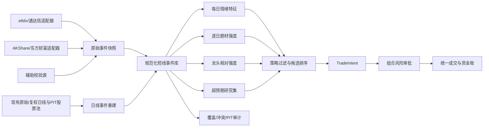

# A 股短线情绪、题材与超预期研究数据层 v1 Spec

| 字段 | 内容 |
|---|---|
| 状态 | Draft；第二轮 CR 修订后，实施前冻结 |
| Spec 版本 | 0.3.0 |
| 创建日期 | 2026-10-03 |
| 最近修订 | 2026-10-03 |
| 基线代码 | `1f3154a`；实施开始前重新冻结工作树 |
| 基线数据快照 | `sha256:41e541057ccce0d0a136420912cd9efdc15ac5d5f4638420529f08f27151ad9c` |
| 基线数据区间 | 2020-01-02 至 2026-09-30 |
| 上位规范 | [A 股选股研究与组合风险引擎 v2 Spec](selection_research_engine_v2.md) |
| 配套计划 | [短线情绪研究数据层 v1 开发计划](../plans/shortline_emotion_research_data_v1_development_plan.md) |
| 实施原则 | 先建立可审计事件事实，再验证情绪、题材、龙头和超预期假设 |

## 1. 背景

现有项目已经具备逐日股票池、前复权信号、未复权成交、成交额、换手率、流通市值、历史行业、公司行为、初版涨跌停制度、组合风险审批、独立资金账、匹配型随机组合和研究快照。

游资课程中值得验证的新增假设主要依赖以下信息：

1. 市场短线情绪：涨跌停数量、连板高度、晋级率、炸板率和昨日涨停溢价；
2. 题材强度：题材涨停数量、梯队结构、持续时间和前排负反馈；
3. 龙头相对强度：板位、首封时间、开板次数、成交额、流通市值和题材内排名；
4. 超预期：实际开盘、竞价或晋级表现相对事前条件期望的偏差；
5. 退潮过滤：情绪恶化时减少或停止新增风险。

当前 `vcp_residual_v2` 已使用沪深300是否位于 MA200 以上作为入场门禁，以市场残差动量减少个股对市场 beta 的依赖，并在组合层限制行业开放风险。但主候选没有把市场广度、行业强度或行业内趋势龙头用于正式排序。因此，本 Spec 同时定义一条不依赖涨跌停事实的 VCP 市场/行业上下文快速路径，避免完整题材与竞价历史成为验证这些基础假设的前置条件。

付费数据服务不是首期前提。本 Spec 定义如何复用现有免费研究数据，并以自计算日线事件、通达信公开协议和盘后免费接口建立一个可降级、可审计、符合 PIT（point-in-time）要求的数据层。

## 2. 目标

本版本必须实现或为后续实现明确约束：

- 从现有未复权日线重建可复现的历史涨跌停事实；
- 从现有 PIT 股票池、日线与历史行业直接生成价格无关的市场广度和行业强度；
- 生成每日市场情绪特征，并保存明确的统计分母；
- 以稀疏事件表接入首封时间、开板次数、竞价和涨停原因；
- 以逐日快照保存题材成员关系，禁止用当前概念回填历史；
- 为龙头相对强度和超预期提供无前视的特征契约；
- 为 VCP 定义行业内趋势龙头特征，不把连板龙头定义强加给非涨停候选；
- 在外部免费源缺失时继续运行核心日线派生链路；
- 复用现有 `TradeIntent -> Risk -> Executor` 路径；
- 输出覆盖率、冲突率、缺失原因和数据来源，使每个特征可追溯；
- 为后续实验提供冻结、消融和准入规则，但不预设策略有效。
- 将市场风险覆盖、行业选择、行业内龙头排序和题材事件增强分别验证，不一次合成为综合评分。

## 3. 非目标

本版本不包含：

- 实盘下单；
- 绕过登录、验证码、访问控制或供应商限流；
- 保证免费第三方源具备五年完整历史；
- 使用当前题材标签回填历史；
- 用日线 OHLC 推断精确首封时间、开板次数或封单变化；
- 把行业分类描述成市场题材；
- 用当日09:25竞价信息假设能够按当日09:30开盘价成交；
- 自动搜索情绪阈值、题材权重、龙头评分或模型超参数；
- 把课程叙述直接视为可交易规则；
- 北京证券交易所股票。北交所若进入研究范围，必须先扩展证券主表和价格限制规则。

## 4. 强制原则

### 4.1 事实、特征和策略分层

系统必须分为三个互不覆盖的层次：

```text
事实层：某股是否封板、是否触板、首封时间、题材成员关系
  -> 特征层：涨停数、炸板率、晋级率、题材强度、超预期残差
  -> 策略层：是否产生交易意图、如何排序、是否允许新增风险
```

修正策略或评分不能改写事实层；修正数据源不能静默覆盖旧实验。

### 4.2 PIT 与可用时间

每条外部或派生记录必须至少区分：

```text
trade_date       事件所属交易日
effective_at     事件实际发生或生效时间
available_at     研究者最早能够可靠获得该记录的时间
ingested_at      本项目实际抓取时间
```

策略在决策时间 `decision_at` 只能读取 `available_at <= decision_at` 的记录。供应商接口能够查询过去日期，不等于该字段在过去当时已经可见。

### 4.3 失败关闭

- ST 状态未知：主样本不得假设为普通10%涨跌幅股票；
- 无法确定价格限制：不生成确定性涨停标签，记录 `UNKNOWN_LIMIT_RULE`；
- 无精确首封时间：保持空值，不用日线伪造；
- 无历史题材快照：不得用当前题材回填；
- 外部源不可用：核心日线派生继续运行，精确事件字段降级为空；
- 多源冲突：保留全部来源和冲突标记，不按对策略有利的值选择；
- 竞价数据覆盖不足：不得进入依赖竞价的正式回测。

### 4.4 原始数据不可变

第三方响应必须先以原始形式落盘，再生成规范化记录。原始文件一旦进入研究快照，不得原地覆盖。重抓结果使用新的抓取批次和哈希。

### 4.5 免费源不是稳定服务

免费源的字段、历史保留期、限流和服务状态可能变化。数据适配器必须与策略逻辑解耦，核心特征不能依赖某一个免费接口才能启动。

### 4.6 历史可获得性证据

历史接口在今天能够返回某个过去日期，不能单独证明该字段在当时已经公开，也不能证明它后来没有被修订。每条外部记录必须保存：

```text
availability_evidence
provider_timestamp
observed_live_at
archive_reference
backfill_queried_at
```

`availability_evidence` 取值至少包括：

```text
OBSERVED_LIVE
PROVIDER_TIMESTAMP
ARCHIVED_SNAPSHOT
BACKFILLED_QUERY
DERIVED_FROM_IMMUTABLE_MARKET_DATA
UNKNOWN
```

字段同时分为：

```text
IMMUTABLE_MARKET_OBSERVATION  # 成交、报价、原始OHLC等市场事实
PROVIDER_DERIVED_EVENT        # 首封时间、供应商事件标签等
EX_POST_CLASSIFICATION        # 题材、涨停原因等可能事后修订的分类
CURRENT_SNAPSHOT_ONLY         # 只能证明抓取时点状态
```

使用规则：

- 可由当日原始市场数据确定并经过交叉核验的事实，可以进入历史事实层；
- `PROVIDER_DERIVED_EVENT` 必须保存字段语义和质量等级；
- `EX_POST_CLASSIFICATION` 只有具备可信的发布时间、供应商时间戳或历史归档时，才允许作为历史信号特征；
- `BACKFILLED_QUERY` 且缺少其他时间证据的分类字段，默认只能用于标签、对账、事件研究和离线解释；
- `CURRENT_SNAPSHOT_ONLY` 不得回填到抓取时间之前。

### 4.7 特征、预测和未来结果物理隔离

用于决策的 as-of 特征、模型预测和事后结果必须写入不同表或不同不可混用的数据集：

```text
features_asof_<decision_time>
predictions_asof_<decision_time>
forward_outcomes
realized_surprises
```

未来结果不得与 as-of 特征共享一行一个 `available_at`。分析层可以联表，但策略特征加载器只能读取明确的 as-of 数据集。

## 5. 复用范围

### 5.1 可复用或有条件复用

| 现有模块 | 复用方式 |
|---|---|
| `SelectionPanelV2` | 交易日、证券、PIT 股票池、停牌、ST、行情与字段覆盖 |
| `ABuPriceLimit` | 仅复用定点金额计算和既有测试思路；当前规则函数不得未经修复直接用于事实层 |
| 原始价格矩阵 | 判断触板、封板、跌停和次日开盘表现 |
| 复权价格矩阵 | 计算趋势、收益和跨公司行为连续特征 |
| 成交额、换手率、流通市值 | 龙头和题材内横截面排序 |
| 历史行业矩阵 | 行业版群体强度和 placebo 匹配，不冒充题材 |
| `TradeIntent` | 保存情绪状态、题材、龙头和超预期元数据 |
| `PortfolioRiskEngine` | 总风险、行业风险、同日新增风险和压力审批 |
| `PortfolioExecutor` | 复用资金账、费用、滑点、订单和停牌处理；涨跌停参考价与规则必须升级后使用新执行版本 |
| 数据冻结与覆盖审计 | 新增事件文件的哈希、来源和字段覆盖 |
| placebo v2 与统计报告 | 判断信号是否超过同条件随机选择 |

### 5.2 不直接复用

以下信息当前不存在或语义不相同：

- 历史题材成员关系；
- 涨停原因；
- 精确首次、最后封板时间；
- 日内开板和回封次数；
- 09:15 至09:25竞价路径；
- 虚拟匹配量和未匹配买卖量；
- 题材内前排和后排关系；
- 可在竞价后执行的分钟级撮合模型；
- 当前 `ABuPriceLimit.price_limit_rule` 的统一 ST 5%分支和不完整特殊交易状态；
- 当前执行器用上一有效原始收盘价推导当日涨跌停价的逻辑。

这些字段必须进入独立事件数据层，不能加入现有行业字段或从日线强行推断。

## 6. 目标架构



事件库以长表为主。只有稳定的一值型每日特征才可以投影为日期×证券矩阵。

## 7. 数据源与优先级

### 7.1 来源角色

| 来源 | 角色 | 允许用途 | 不允许假设 |
|---|---|---|---|
| 现有未复权日线 | 核心事实源 | 历史封板、触板、跌停、连板、次日收益 | 精确封板时间和开板次数 |
| eltdx/通达信公开协议 | 精细事件候选源 | 竞价、分钟、涨跌停列表、原因、题材和天梯 | 服务稳定、历史必然完整 |
| AKShare/东方财富 | 盘后快照源 | 近期涨停池、跌停池、炸板池及字段交叉验证 | 可以回补五年历史 |
| zzshare 等免费托管服务 | 辅助源 | 试验和交叉核验 | 唯一事实源或长期 SLA |
| BaoStock | 行情备用源 | OHLCV、交易状态和 ST 辅助校验 | 涨停事件、题材和竞价 |

外部项目及接口的使用必须遵守其许可证、服务条款和用途限制。首期按个人、非商业研究设计；若转为生产或商业用途，必须重新进行授权审查。

### 7.2 字段级权威关系

不设置一个覆盖所有字段的“全局权威源”，而是按字段定义：

- 收盘封板、触板、跌停：现有原始日线重建为主；
- 精确首封时间、最后封板时间、开板次数：事件源为主，日线无替代值；
- 成交额、换手率、流通市值：现有研究快照为主；
- 题材和涨停原因：带日期的事件快照为主；
- 行业：现有 CNINFO 历史行业矩阵为主；
- 竞价：带抓取时间和交易日的竞价源为主；
- 供应商给出的“连板数”：只用于对账，正式历史连板由规范化封板事实重新计算。

### 7.3 冲突处理

任何冲突不得静默覆盖。规范化记录必须保存：

```text
canonical_value
canonical_rule_version
source_values
conflict_code
resolution_reason
```

至少统计以下冲突：

- 日线显示封板但事件池无记录；
- 事件池显示涨停但原始收盘未达到计算涨停价；
- 多源首封时间不一致；
- 多源涨停原因不一致；
- 题材成员关系在同一时点冲突；
- 供应商连板数与本地重算不一致。

## 8. 原始快照规范

目录建议：

```text
selection_research/
  shortline_raw/
    provider=<provider>/dataset=<dataset>/trade_date=<YYYYMMDD>/
      <ingestion_id>.json
  shortline_normalized/
  shortline_features/
```

每个抓取批次必须记录：

```text
ingestion_id
provider
dataset
request_parameters
requested_trade_date
request_started_at
response_received_at
provider_timestamp
availability_evidence
field_semantics_version
http_or_protocol_status
row_count
payload_sha256
schema_sha256
adapter_version
error_code
retry_count
```

同样的原始 payload 经相同适配器版本处理，必须得到相同规范化结果。

空响应必须区分：

```text
CONFIRMED_ZERO_EVENTS
PROVIDER_EMPTY_UNKNOWN
REQUEST_FAILED
SCHEMA_CHANGED
HISTORY_NOT_RETAINED
```

只有 `CONFIRMED_ZERO_EVENTS` 可以被解释为当日确实没有事件。

## 9. 日线涨跌停事实

### 9.1 输入

日期 `t`、证券 `s` 使用：

- `universe_mask[t,s]`；
- 当日交易所或行情参考数据中的涨跌停参考价；
- 当日交易所直接发布的涨停价和跌停价（如可得）；
- 未复权 OHLCV；
- 板块；
- 上市交易日序号；
- `st_status[t,s]` 与 `st_status_known[t,s]`；
- 风险警示、退市整理、重新上市、特殊复牌等交易状态；
- 版本化的价格限制规则引擎。

### 9.2 涨跌停参考价

涨跌停参考价不得直接定义为上一根未复权 K 线收盘价。除权除息日即时行情中的前收盘价可能是除权除息参考价；退市整理首日、重新上市首日和其他特殊状态也可能适用无涨跌幅限制或不同参考规则。

规范字段：

```text
limit_reference_price_raw
reference_price_source
reference_price_effective_at
reference_price_available_at
reference_price_quality
exchange_upper_limit_raw
exchange_lower_limit_raw
```

来源优先级：

1. 交易所证券参考文件或行情主站直接提供的前收盘、涨停价和跌停价；
2. 经覆盖审计的历史行情接口中的 `pre_close/reference_price`；
3. 在公司行为、特殊交易状态和交易所公式完整时由本地重建；
4. 无法确认时标记 `UNKNOWN_REFERENCE_PRICE`，不得退回普通上一交易日收盘价生成确定性标签。

`previous_raw_close` 可以作为审计字段保留，但不能默认作为 `limit_reference_price_raw`。

### 9.3 价格限制状态机

规则键至少包括：

```text
exchange
board
trade_date
security_status
listing_stage
delisting_stage
special_trading_event
status_known
```

首期规则矩阵至少覆盖：

- 沪深主板普通股票及历史制度变更；
- 主板风险警示股票，包括2026-07-06前后的比例变化；
- 创业板注册制前后的普通和风险警示股票；
- 科创板普通和风险警示股票；
- 新股无涨跌幅限制阶段；
- 退市整理首日及后续交易日；
- 重新上市首日；
- 发生权益分派、送转、配股后的参考价；
- 交易所明确指定的其他特殊状态。

风险警示不能在判断板块和日期之前统一映射成5%。普通复牌本身也不能直接推导是否无涨跌幅限制，必须读取具体交易状态。

交易所直接给出的涨跌停价格是事实层优先值；规则引擎用于补全和审计。两者冲突时保留冲突，不静默覆盖。当前 `ABuPriceLimit.price_limit_rule` 在完成上述扩展前只能作为旧执行兼容逻辑，不能作为本事实层的权威实现。

### 9.4 金额精度

判断前将 OHLC 和涨跌停价统一转为以“分”为单位的整数。价格限制继续使用十进制 `ROUND_HALF_UP`。禁止用诸如 `pct_change >= 9.9%` 的近似条件替代交易所价格。

### 9.5 规范化字段

`daily_limit_facts` 至少包含：

```text
trade_date
symbol
board
is_st
st_status_known
listing_session
previous_raw_close
limit_reference_price_raw
reference_price_source
reference_price_available_at
reference_price_quality
reference_availability_evidence
exchange_upper_limit_raw
exchange_lower_limit_raw
limit_rule_id
limit_rule_version
security_status
listing_stage
delisting_stage
special_trading_event
upper_limit_raw
lower_limit_raw
opened_raw
high_raw
low_raw
closed_raw
volume
amount
touched_upper
closed_upper
opened_upper
touched_lower
closed_lower
opened_lower
failed_upper_close
one_price_upper
one_price_lower
data_quality_codes
calculation_version
available_at
```

上表中 `previous_raw_close` 只用于对账。如果存在交易所直接上下限，则 `upper_limit_raw/lower_limit_raw` 取直接值，并记录来源；否则才由已验证的参考价和规则计算。

定义：

```text
touched_upper      = high_fen >= upper_limit_fen
closed_upper       = close_fen == upper_limit_fen
opened_upper       = open_fen == upper_limit_fen
failed_upper_close = touched_upper AND NOT closed_upper
one_price_upper    = open_fen == high_fen == low_fen == close_fen == upper_limit_fen
```

下限方向同理。没有日涨跌幅限制时，上述状态为空而不是 false。

### 9.6 连板

`consecutive_limit_up[t,s]` 使用本项目重建的 `closed_upper` 计算。严格连板要求连续市场交易日收盘封板；停牌、非封板、状态未知或无价格限制均中断严格连板。

另行计算观察窗口指标，不与严格连板混用：

```text
limit_up_days_in_3
limit_up_days_in_5
limit_up_days_in_10
```

### 9.7 晋级率

对板位 `n`：

```text
unconditional_denominator_n[t]
  = t-1 日 consecutive_limit_up == n 的全部证券数

tradable_denominator_n[t]
  = 上述证券中 t 日可交易、价格限制已知且行情完整的证券数

promotion_numerator_n[t]
  = 昨日该板位证券中 t 日 closed_upper 的证券数

unconditional_promotion_rate_n[t]
  = promotion_numerator_n[t] / unconditional_denominator_n[t]

tradable_promotion_rate_n[t]
  = promotion_numerator_n[t] / tradable_denominator_n[t]
```

同时输出正常未晋级、停牌、终止上市、状态未知、参考价未知和行情缺失数量。任一分母为零时对应结果为空，不填0。

### 9.8 炸板率

日线近似口径：

```text
upper_touch_count = count(touched_upper)
failed_upper_count = count(failed_upper_close)
approx_break_rate = failed_upper_count / upper_touch_count
```

它只能表示“触及涨停但收盘未封住”，字段和报告必须包含 `approx`，不得描述为精确开板次数或盘中炸板路径。

同时报告：

```text
approx_break_rate_all_touches
approx_break_rate_excluding_one_price
approx_break_rate_by_exchange_board
```

每个口径必须保存自己的分子、分母和规则已知覆盖率。

## 10. 精细短线事件表

外部事件源规范化为 `intraday_limit_event`：

```text
trade_date
symbol
event_type
first_limit_time
last_limit_time
open_break_count
seal_amount
limit_reason_raw
limit_reason_normalized
provider_streak
source
source_record_id
effective_at
available_at
ingested_at
availability_evidence
provider_timestamp
raw_payload_sha256
quality_codes
```

规则：

- `first_limit_time` 不得早于当日开盘且不得晚于收盘；
- 精确时间缺失时为空，不能以日线高价替代；
- `open_break_count` 的供应商定义必须写入 adapter 版本；
- 原始涨停原因永久保留，规范化原因另建字段；
- 同一股票同日多条原因允许多值，不强制覆盖成一条；
- 事件源连板数只用于审计，不覆盖本地重建值。
- 回补的涨停原因、题材和供应商标签缺少可信历史发布时间时，只能用于标签、对账或事件研究。

## 11. 市场情绪特征

市场情绪必须物理拆成两个 as-of 数据集。`market_emotion_asof_open` 只包含当日开盘后已经可见的字段，例如昨日涨停股当日开盘表现；`market_emotion_asof_close` 只包含当日收盘后可见的字段。分析层可以按交易日联表，但策略加载器不得读取合并后的宽表。

两个表共同保存：

```text
trade_date
exchange_scope
board_scope
decision_time
eligible_universe_count
known_limit_rule_count
unknown_limit_rule_count
known_reference_price_count
limit_up_count
limit_down_count
upper_touch_count
failed_upper_count
approx_break_rate
one_price_limit_up_count
max_consecutive_limit_up
streak_2_count
streak_3_count
streak_4_plus_count
promotion_1_to_2
promotion_2_to_3
promotion_3_to_4
previous_limit_up_next_open_mean
previous_limit_up_next_close_mean
previous_limit_up_positive_open_rate
previous_limit_up_positive_close_rate
advance_decline_ratio
breadth_above_ma120
coverage_ratio
available_at
feature_version
```

其中开盘、收盘不适用的字段不进入对应表，而不是以未来值补齐。

### 11.1 可用时间拆分

同一交易日的特征可能有不同可用时间：

- 昨日涨停股今日开盘表现：今日开盘后可用；
- 今日封板、炸板近似、今日收盘表现：今日收盘后可用；
- 精确涨停池和原因：以实际抓取完成时间为准。

不能把整行统一标记为早于最晚字段的时间。本 Spec 强制拆分 open/close 表；字段级 availability 可以作为补充，但不能替代物理隔离。

### 11.2 覆盖门槛和分市场报告

每个交易日同时保存：

```text
full_eligible_count
known_rule_count
unknown_rule_count
known_reference_price_count
coverage_ratio
```

`coverage_ratio` 的主口径为同时具备已知价格限制规则和已知参考价的证券数除以 `full_eligible_count`；规则覆盖率和参考价覆盖率另行单独报告。

首轮研究配置冻结：

```text
minimum_limit_fact_coverage = 0.95
```

当全市场或某个分组的规则与参考价综合覆盖率低于门槛时，该范围的情绪状态必须为 `UNKNOWN`。连续特征仍可输出，但不得被描述为完整市场状态或进入主策略信号。

至少分别输出：

- 上海、深圳；
- 主板、创业板、科创板；
- 全市场已知规则样本。

在上海历史 ST 状态补齐并通过覆盖门槛前，汇总序列命名为“已知规则样本情绪”，不得称为“全市场情绪”。

### 11.3 情绪状态

v1 先输出连续特征，不在数据层硬编码“冰点、修复、高潮、退潮”等主观标签。状态模型必须另行版本化，并满足：

- 只使用当时可见特征；
- 阈值来自预先冻结规则或滚动历史分位数；
- 不用全样本均值、方差和分位数标准化历史数据；
- 输出状态、置信度、触发指标和规则版本；
- 修改状态规则不得改写底层事实与特征。

建议首个可证伪状态模型仅使用少量变量：最高连板、炸板近似率、昨日涨停股次日收益、涨跌停数量和晋级率。不先引入复杂综合评分。

### 11.4 价格无关市场广度快速路径

以下市场上下文只依赖 PIT 股票池和当日及以前日线，不依赖涨跌停参考价、历史 ST 价格限制或外部题材源：

```text
trade_date
decision_time
universe_scope
eligible_universe_count
advance_count
decline_count
unchanged_count
positive_return_ratio
cross_section_return_median
breadth_above_ma20
breadth_above_ma60
breadth_above_ma120
new_high_20d_ratio
new_low_20d_ratio
equal_weight_return_1d
equal_weight_return_5d
coverage_ratio
available_at
feature_version
```

该视图命名为 `market_breadth_asof_close`，可以在价格限制状态机完成前先行构建。至少同时报告 `full_eligible` 和 `signal_eligible` 两种 `universe_scope`，禁止把两者拼接成一条序列。分母必须满足：当日已上市、未退市、达到对应指标最短历史长度且当日价格可用。停牌、已知 ST、ST 未知和行情缺失必须分别计数，不得通过删除缺失证券提高广度。趋势、收益和新高/新低使用冻结快照中的复权信号价格；成交与价格限制仍使用未复权价格。

`positive_return_ratio` 使用 `close_qfq[t] / close_qfq[t-1] - 1 > 0`；各 MA 广度分别使用满足对应历史长度的独立分母；`new_high_20d_ratio` 使用 `close_qfq[t] > max(high_qfq[t-20:t])`，`new_low_20d_ratio` 对称定义。停牌或没有连续端点价格的证券不进入相应指标分母，但必须进入缺失/停牌计数。所有分子、分母和排除原因随结果保存。

`market_emotion_asof_close` 中同名广度字段必须引用此视图或通过逐日一致性审计。不得同时维护两个语义不同但名称相同的 `breadth_above_ma120`。

该快速路径只提供连续特征。任何 `NORMAL/CAUTION/RETREAT` 状态仍需单独版本化、预登记并使用滚动或扩展历史阈值。

## 12. 行业代理与题材强度

### 12.1 行业代理强度

历史行业矩阵可以在题材历史不足时提供明确标记的 `industry_proxy`。它不依赖涨跌停参考价，可以与第11.4节并行先行构建。

`industry_strength_daily` 至少包含：

```text
trade_date
industry_id
industry_name
eligible_member_count
return_5d
return_20d
return_60d
excess_return_20d_vs_market
breadth_above_ma20
breadth_above_ma60
breadth_above_ma120
new_high_20d_ratio
positive_member_ratio
median_member_return
amount_expansion
return_dispersion
coverage_ratio
available_at
feature_version
```

首轮计算口径冻结在 `market_industry_context_v1.json`：

```json
{
  "signal_price_space": "frozen_qfq",
  "market_benchmark": "sh000300",
  "return_windows": [5, 20, 60],
  "ma_windows": [20, 60, 120],
  "new_high_window": 20,
  "leader_high_window": 120,
  "leader_slope_window": 20,
  "capture_window": 60,
  "minimum_capture_sessions": 10,
  "breakout_window": 20,
  "breakout_order_lookback": 20,
  "amount_short_window": 5,
  "amount_control_window": 20,
  "minimum_industry_members": 5,
  "minimum_member_coverage": 0.80,
  "rank_method": "percentile_average_ties"
}
```

`return_Nd` 是当日 PIT 成员各自 `close_qfq[t] / close_qfq[t-N] - 1` 的等权平均；`excess_return_20d_vs_market` 减去同期沪深300收益。`amount_expansion` 先逐日汇总行业成交额，再以 `t-4…t` 的中位数除以不重叠的 `t-24…t-5` 中位数。`return_dispersion` 使用成员20日收益的 median absolute deviation。窗口端点、最小覆盖和并列排名方法不得在首次查看策略收益后修改。

约束：

- 行业成员关系必须使用信号日可见的历史行业矩阵；
- 行业收益使用 PIT 成员等权计算，同时保存可用成员数和覆盖率；
- 行业强度首期输出连续分量和同日跨行业排名，不硬编码“主线”标签；
- 市场超额收益只能使用同一决策时点可见的市场收益；
- 行业内缺失证券不得按零收益或有利收益填充；
- `industry_proxy` 的结果不得描述为题材效应。

### 12.2 题材成员快照

`theme_membership_snapshot`：

```text
trade_date
source_theme_id
source_theme_name
canonical_theme_id
canonical_theme_name
taxonomy_version
symbol
membership_type
limit_reason_relation
source
valid_from
valid_to
effective_at
available_at
mapping_available_at
ingested_at
raw_payload_sha256
```

要求：

- 同一股票同日允许属于多个题材；
- 题材名称必须经过别名映射，但保留原始名称；
- 无法确认历史有效时间的当前概念只能标记为 `CURRENT_ONLY`；
- `CURRENT_ONLY` 不得进入历史回测；
- 行业替代实验必须使用 `industry_proxy` 名称，不得输出为题材结果。
- 题材改名、合并、拆分和别名映射必须保留 `valid_from/valid_to`；
- 规范化映射只有在 `mapping_available_at` 之后才能用于策略，不得用今天建立的分类体系改写历史 as-of 特征；
- 需要跨期统一口径的离线分析可以使用最新 taxonomy，但必须命名为 `retrospective_taxonomy`，不得进入历史交易信号。

### 12.3 题材日特征

`theme_strength_daily` 至少包含：

```text
trade_date
canonical_theme_id
eligible_member_count
limit_up_count
upper_touch_count
failed_upper_count
max_streak
streak_level_count_1
streak_level_count_2
streak_level_count_3_plus
positive_member_ratio
median_member_return
theme_active_days
coverage_ratio
available_at
feature_version
```

“梯队完整度”不得直接写成主观文本，首期保存各板位数量和覆盖率，由单独版本化公式计算。

未来表现单独保存为 `theme_forward_outcomes`：

```text
trade_date
canonical_theme_id
label_name
label_period_start
label_period_end
outcome_value
outcome_available_at
label_version
```

`top_group_next_open_return` 等字段只能出现在该结果表，不得出现在 `theme_strength_daily`。

### 12.4 题材持续性

题材活跃日必须由冻结规则定义，例如当日满足“至少两只封板”或“至少一只二板以上股票”。连续活跃天数只使用此前快照，不允许根据未来持续性回标起始日。

## 13. 龙头相对强度

### 13.1 短线事件龙头

龙头只在同日同题材内比较。候选特征包括：

```text
consecutive_limit_up
first_limit_time
open_break_count
seal_amount / free_float_market_cap
amount
turnover
free_float_market_cap
return_within_theme
first_limit_rank_within_theme
streak_rank_within_theme
amount_rank_within_theme
market_cap_rank_within_theme
```

要求：

- 原始分量和最终评分同时输出；
- 缺失首封时间不能默认视为最早或最晚；
- 多题材股票在每个题材中独立排名；
- 题材映射缺失时只能生成全市场相对强度，不得伪造题材内排名；
- 评分权重属于策略配置，不属于事实数据层；
- 使用流通市值，不以总市值替代而不做标记。

### 13.2 VCP 行业内趋势龙头

VCP 候选不要求曾经涨停。为避免把连板生态的龙头定义强加给趋势突破策略，新增 `industry_trend_leader_daily`：

```text
trade_date
symbol
industry_id
relative_return_20d_within_industry
relative_return_60d_within_industry
residual_momentum_rank_within_industry
ma120_slope_rank_within_industry
distance_to_120d_high_rank_within_industry
up_market_capture_rank_within_industry
down_market_resilience_rank_within_industry
amount_share_within_industry
liquidity_rank_within_industry
breakout_order_rank_within_industry
synchronous_breakout_count
coverage_ratio
available_at
feature_version
```

要求：

- 全部排名只使用当日收盘及以前可见数据；
- `breakout_order_rank_within_industry` 只根据截至当日已发生的突破顺序计算，不得根据未来确认趋势龙头；
- 进攻强度和抗跌性必须冻结观察窗口、市场/行业上涨下跌日定义和最小样本数；
- 原始分量与横截面排名同时保存，组合权重属于策略配置；
- 无历史行业时保持缺失，不回退到当前行业；
- 该表可以在题材、首封时间和开板次数不可用时独立运行。

## 14. 超预期研究集

### 14.1 定义

“超预期”定义为实际结果相对决策前可估计条件期望的偏差，而不是绝对高开或绝对晋级：

```text
open_surprise = actual_next_open_return - expected_next_open_return
promotion_surprise = actual_promotion - expected_promotion_probability
auction_surprise = actual_auction_metric - expected_auction_metric
```

### 14.2 基础条件特征

昨日收盘后可见的输入可以包括：

- 板位；
- 是否一字板；
- 炸板/回封信息；
- 成交额、换手率和流通市值；
- 题材强度和题材内排名；
- 市场情绪状态；
- 市场和行业收益；
- 前一日涨停时间，但仅限有可靠历史事件覆盖的样本。

### 14.3 预期模型

首个版本优先使用滚动经验分组或简单可解释模型，不使用全样本训练。预测、结果和已实现 surprise 强制拆分。

`expectation_predictions` 保存：

```text
prediction_id
prediction_asof
training_start
training_end
model_version
feature_version
training_snapshot_id
expected_value
```

`expectation_actuals` 保存：

```text
prediction_id
label_name
label_period_start
label_period_end
actual_value
outcome_available_at
```

`expectation_surprises` 只有在 outcome 可见后才生成：

```text
prediction_id
expected_value
actual_value
surprise
surprise_available_at
calculation_version
```

训练集结束时间必须早于预测对象结果发生时间。交叉验证使用 expanding window 或 rolling window，不允许随机打散跨期样本。

### 14.4 日线降级版本

没有历史竞价时，允许使用次日原始开盘收益和是否晋级建立日线超预期研究集。该版本命名必须包含 `daily_open`，不得称为竞价超预期。

## 15. 竞价数据与执行边界

`auction_snapshot` 建议包含：

```text
trade_date
symbol
snapshot_time
indicative_price
matched_volume
matched_amount
unmatched_buy_volume
unmatched_sell_volume
limit_reference_price_raw
reference_price_source
auction_return
source
available_at
ingested_at
raw_payload_sha256
quality_codes
```

### 15.1 当前执行器可支持的路径

现有日线执行器支持：

```text
t 日收盘后情绪/题材信号
  -> t+1 开盘执行
```

它也可以把 `t` 日竞价结果作为 `t` 日之后或 `t+1` 的研究特征。

### 15.2 当前执行器不支持的路径

以下路径不能用当前开盘成交模型回测：

```text
t 日09:25读取竞价
  -> t 日09:30按开盘价成交
```

原因是决策发生在开盘形成前后，现有执行器的订单预审批、价格可见性和滑点模型均以“前一收盘生成、下一开盘执行”为前提。

若未来研究该路径，必须增加单独版本的盘中执行模型，至少定义：

- 09:25数据的真实可获得延迟；
- 订单提交时间；
- 09:30后第一个可成交报价或分钟价格；
- 集合竞价排队和未成交规则；
- 涨停封单下不可成交；
- 分钟级成交容量和冲击成本；
- 与日线资金账的一致性。

在该模型完成前，竞价数据只用于事件研究和不早于下一可执行时点的信号。

## 16. 与组合风险引擎的集成

### 16.1 意图元数据

短线策略产生的 `TradeIntent.metadata` 建议保存：

```text
emotion_state_asof
emotion_feature_version
theme_ids_asof
theme_strength_asof
leader_score_components
expectation_model_version
surprise_value
event_snapshot_id
missing_event_fields
```

### 16.2 退潮期风险控制

首期优先把退潮状态作为新买入准入条件：

```text
NORMAL       -> 按原风险配置审批
CAUTION      -> 可配置降低新增风险，但必须产生新风险配置版本
RETREAT      -> 不生成新买入意图；卖出和已有持仓风险管理继续运行
UNKNOWN      -> 主实验不新增风险，敏感性实验另行报告
```

不得直接修改已经冻结的 `risk_v1.json`。任何动态风险乘数都必须形成独立的 `emotion_risk_overlay_v1` 配置和哈希。

情绪恶化不自动等同于强制清仓。若要触发退出，必须作为单独策略版本和实验变量。

### 16.3 VCP 上下文因子接入边界

现有 `vcp_residual_v2` 保持冻结。新增信息分三层接入，且每层必须能独立关闭：

```text
market_context_overlay
  -> 只决定新增风险是否保持、缩量或拒绝

industry_strength_selection
  -> 在原始 VCP 意图之间评价行业方向，不修改个股 VCP 事实

industry_leader_ranking
  -> 只在同一行业内部评价候选相对强度
```

首轮不得把三层合成一个加权总分。市场上下文先以 shadow mode 记录；行业强度和趋势龙头先作为排序或同分决胜信息，不立即增加硬过滤。只有在交易数量和独立入场日簇仍满足上位 Spec 的最低样本门槛时，才允许登记硬过滤版本。

为判断新增因子是否只是重复现有残差动量、MA120斜率或突破强度，每次实验必须输出：

- 新因子与现有评分分量的同日横截面 Spearman 相关；
- 因子分位对应的后续1、3、5、10和20日收益、MAE、MFE及进入 `+1R` 的比例；
- 初始止损、停滞退出和跟踪止损的退出构成；
- 全样本与共同覆盖样本结果；
- 增量因子启用前后的交易数、入场日期簇和盈利集中度。

短线涨跌停情绪与 VCP 持有周期不同。情绪因子必须分别报告对1—5日假突破风险和20日/最终交易结果的关系，不得根据短周期相关性直接触发中期持仓强制退出。

## 17. Placebo 与归因

短线信号的随机基线继续使用 placebo v2 完整执行路径，并增加事件条件匹配。

### 17.1 情绪过滤实验

对照组使用相同原始策略意图、相同日期和执行路径，只改变是否应用情绪过滤。必须报告：

- 被过滤交易数量；
- 过滤前后成交率；
- 收益和回撤变化；
- 被过滤交易自身后续表现；
- 收益改善是否仅来自降低市场暴露。

### 17.2 题材和龙头实验

题材方向选择和题材内部龙头选择检验不同的假设，必须使用不同的 placebo：

1. `industry_or_theme_selection_placebo`：验证选择强行业/题材是否有效。匹配日期、可执行时间、价格、流动性、波动率、市值和价格限制，但不得匹配正在检验的行业/题材强度；
2. `within_group_leader_placebo`：验证同一行业/题材内的龙头排序是否有效。必须固定行业或题材，再从可比成员中随机选择；
3. `full_context_placebo`：只用于评价组合后的剩余个股选择能力，匹配当日情绪状态和已启用的上游方向暴露。

对应 placebo 至少考虑：

- 信号日期和可执行时间；
- 当日情绪状态；
- 题材或行业代理；
- 板位；
- 价格、成交额、换手率和流通市值；
- 适用涨跌停规则；
- 历史波动率。

如果龙头对照不匹配题材/行业和板位，结果只能说明暴露差异，不能说明龙头排序有效。反过来，如果强题材选择实验预先匹配相同题材强度，就会把待检验效应控制掉，也不能用于判断题材选择是否有效。

### 17.3 超预期实验

应比较同一预期分组内不同 surprise 分位的后续收益，不能只比较高开股与全部股票。预期模型、surprise 排序和交易规则必须分开消融。

### 17.4 数据 Spec 与策略 Spec 的边界

本文件只冻结事实、特征、PIT、质量和接入边界，不定义完整短线交易规则。进入任何收益回测前，必须另建并冻结“短线情绪策略 Spec”，至少定义：

```text
base_strategy_version
signal_decision_time
required_feature_view
candidate_universe
ranking_formula
max_buy_price
max_gap
order_validity
initial_stop
r_definition
exit_priority
t_plus_one_behavior
suspension_and_limit_behavior
existing_position_behavior_on_retreat
```

策略 Spec 必须区分：

1. `market_context_overlay`：使用价格无关广度控制是否新增风险或风险预算；
2. `industry_strength_selection`：评价行业方向，主要评价成本后选股期望；
3. `industry_leader_ranking`：在固定行业内评价 VCP 趋势龙头；
4. `emotion_risk_overlay/theme_leader_selection`：使用涨跌停情绪、题材和短线事件龙头；
5. `expectation_surprise_signal`：使用预测偏差，必须明确偏差可用时间和执行时点。

五类作用分别消融。风险覆盖层让原策略减少亏损，不能被解释为行业、题材或龙头选股产生 alpha。

### 17.5 实验预登记

在第一次查看新特征对应的策略收益前，必须生成对应实验族的不可变注册表。M8A 使用 `vcp_context_experiment_registry_v1.json`，M8B 使用 `shortline_event_experiment_registry_v1.json`；后者不得覆盖或改写前者。每个注册表至少冻结：

```text
primary_hypothesis
base_strategy_version
primary_metric
secondary_metrics
parameter_set
feature_versions
historical_diagnostic_period
walk_forward_protocol
forward_start_date
minimum_trade_count
minimum_entry_clusters
common_coverage_definition
multiple_testing_family
multiple_testing_policy
placebo_version
stop_conditions
```

2020—2026年数据已经被反复观察，不得重新命名其中一段为“未触碰测试集”。历史数据只用于预登记后的滚动样本外诊断和淘汰；真正留出证据来自参数冻结后的前瞻模拟盘。

短线事件数据的名义前瞻起始日为 `2026-10-09`，实际起算日定义为
`FIRST_SUCCESSFULLY_ARCHIVED_TRADING_SESSION_ON_OR_AFTER_DATE`。成功归档要求
同一交易日的涨停、跌停、炸板、昨日涨停和强势股池全部通过 schema、同日
可获得性与规范化检查。起算锚点一经建立不可回写。样本积累期间所有短线
事件因子保持 `shadow_only`，不得改变模拟盘订单、排序、风险审批或退出。

每个实验同时报告成本后收益及置信区间、最大回撤、Expected Shortfall、平均市场敞口、行业和市场 beta、换手、容量以及相同执行路径 placebo 分位数。新增变体必须进入同一多重检验族，不能只登记表现最好的版本。

## 18. 数据质量与覆盖报告

每次构建必须输出：

```text
shortline_source_coverage_daily.csv
shortline_field_coverage_daily.csv
shortline_symbol_coverage.csv
shortline_provider_conflicts.csv
shortline_missing_reasons.csv
shortline_build_manifest.json
```

最低报告指标：

- 每日 PIT 股票池数量；
- ST 状态已知比例；
- 可确定涨跌停规则比例；
- 可确定涨跌停参考价比例；
- 原始 OHLCV 可用比例；
- 本地重建与外部涨停池的一致率；
- 首封时间、开板次数和原因覆盖率；
- 竞价字段覆盖率与最早可回溯日期；
- 题材成员快照覆盖率；
- 多源冲突率；
- 各字段的 `availability_evidence` 分布；
- 抓取失败、空响应和 schema 变化次数。

不得只给总体覆盖率。必须按日期、证券、交易所和板块分别报告，避免少量近期完整数据掩盖历史缺口。

## 19. 验收标准

### 19.1 日线事实层

- 对现有快照全部交易日确定性重建；
- 相同输入和版本生成相同哈希；
- 主板、创业板、科创板、ST、IPO、退市整理、重新上市和除权除息都有固定样例；
- 参考价来自可审计字段或完整重建，不使用上一有效收盘价作为无条件 fallback；
- 创业板和科创板风险警示股票不会落入统一5%规则；
- 2026-07-06前后主板风险警示比例按各自制度处理；
- 未知 ST 和无涨跌停阶段不会生成虚假标签；
- 公司行为前后使用原始价格，不产生复权伪涨停；
- 日线近似炸板明确带 `approx` 标记。

### 19.2 外部事件层

- 先完成历史覆盖审计，再决定是否进入正式研究；
- 原始 payload、适配器版本和规范化结果可追踪；
- schema 改变时停止规范化并报警，不静默错列；
- 空响应与“当日确实无事件”能够区分；
- 多源冲突进入审计表。

### 19.3 PIT

- 修改未来记录不得改变历史事实和特征；
- 当前题材成员不得出现在其首次快照之前；
- 次日开盘和晋级结果不得进入昨日预期模型输入；
- 09:25竞价不得用于假设09:30开盘成交；
- 外部历史查询结果使用其真实 `available_at`，不得伪装为历史当时可见；
- `BACKFILLED_QUERY` 的事后分类字段不会进入历史 as-of 特征；
- 题材 taxonomy 映射不会在 `mapping_available_at` 之前生效；
- 特征加载器无法读取 `forward_outcomes` 和 `expectation_actuals`。

### 19.4 策略接入

- 事件缺失不破坏资金账和已有策略；
- 情绪过滤只影响新意图，不影响卖单处理；
- 新意图继续通过统一风险和执行器；
- 所有缺失字段、过滤和拒单都有原因码；
- placebo 使用相同事件覆盖和执行路径。

## 20. 测试要求

### 20.1 单元测试

- 市场广度各期限使用独立可复算分母；
- `full_eligible` 与 `signal_eligible` 不混用；
- 停牌、ST 未知和缺失行情不被填成上涨、下跌或零收益；
- 行业变更只在生效日及以后改变成员关系；
- 行业强度等权收益、成交额扩张和 MAD 与手工样本一致；
- 行业内趋势龙头排名不读取未来突破或未来行业成员；
- 价格转分和涨跌停四舍五入；
- 除权除息参考价与昨日实际收盘不同时仍能正确判断；
- 创业板、科创板风险警示和2026年前后主板风险警示规则；
- 退市整理首日、重新上市首日和新股无涨跌幅阶段；
- 触板、封板、炸板近似和一字板识别；
- 连板在非封板、停牌和未知状态时重置；
- 晋级率分母为零时返回缺失；
- 多题材成员和别名映射；
- 外部空响应与零事件的区别；
- 同 payload 规范化幂等；
- 冲突保留而非覆盖；
- availability 时间过滤；
- availability evidence 与字段类别准入；
- taxonomy 双时态映射；
- as-of 特征表不能联入未来标签；
- expanding-window 预期模型无未来样本。

### 20.2 集成测试

- 不读取价格限制、题材或竞价数据也能完整生成 M0A 三张特征表；
- 新旧 `breadth_ma120` 差异可以逐日归因；
- 选取已知主板、创业板、科创板和 ST 日期，与公开行情人工核验；
- 选取除权除息、退市整理、重新上市样例与交易所参考价核验；
- 在 AKShare 与 eltdx 同时覆盖的日期比较涨停池；
- 外部源关闭时完整生成日线情绪表；
- 模拟供应商改字段、超时、重复和乱序；
- 冻结快照后重建结果完全一致；
- 情绪元数据随 `TradeIntent` 进入订单和实验清单。

### 20.3 回归测试

新增事件层但未启用新策略时，现有 v2 策略、风险引擎和执行器的交易路径必须不变。

## 21. 建议代码与数据结构

```text
abupy/AlphaBu/
  ABuLimitReference.py           # 参考价、交易状态和字段质量
  ABuPriceLimit.py               # 扩展为日期/板块/状态驱动的规则状态机
  ABuShortLineEvents.py          # 规范化事件对象和事实表构建
  ABuMarketBreadth.py            # 价格无关市场广度和赚钱效应
  ABuMarketEmotion.py            # 市场情绪连续特征
  ABuIndustryStrength.py         # 历史行业强度和 VCP 趋势龙头
  ABuThemeStrength.py            # 题材快照与强度
  ABuExpectationModel.py         # 滚动预期与 surprise

abupy/MarketBu/
  ABuDataFeedEltdx.py            # 可选通达信协议适配器
  ABuDataFeedShortLineAkShare.py # 盘后事件池适配器

configs/selection/
  shortline_data_v1.json
  market_industry_context_v1.json
  emotion_state_v1.json
  emotion_risk_overlay_v1.json
  vcp_context_overlay_v1.json
  vcp_context_experiment_registry_v1.json
  shortline_event_experiment_registry_v1.json

scripts/
  build_daily_limit_facts.py
  audit_limit_reference.py
  build_market_context_features.py
  build_industry_strength_features.py
  collect_shortline_snapshots.py
  normalize_shortline_events.py
  build_market_emotion_features.py
  audit_shortline_coverage.py
  freeze_shortline_snapshot.py

tests/
  test_limit_reference.py
  test_price_limit_regimes.py
  test_daily_limit_facts.py
  test_market_breadth.py
  test_industry_strength.py
  test_shortline_event_normalization.py
  test_market_emotion_features.py
  test_theme_strength.py
  test_expectation_model.py
  test_shortline_pit.py
  test_feature_outcome_isolation.py
```

名称是建议结构；实现前可以在不改变数据契约的前提下调整。

## 22. 分阶段实施

### M0：冻结规范和基线

- 登记修复前代码 `1f3154a`、现有数据快照和历史结果；
- 将参考价和价格制度缺陷登记为已知基线问题；
- 冻结本 Spec 0.3.0；
- 登记现有工作树中与本项目无关的修改；
- 明确首期只研究沪深 A 股；
- 完成条件：输入、版本和非目标清晰可审计。

### M0A：价格无关市场与行业快速路径

- 使用现有 PIT 股票池构建 `market_breadth_asof_close`；
- 使用历史行业矩阵构建 `industry_strength_daily`；
- 构建不依赖涨停事件的 `industry_trend_leader_daily`；
- 与现有 `breadth_ma120` 逐日对账并冻结唯一权威口径；
- 只生成特征、覆盖和相关性诊断，不查看策略收益；
- 完成条件：未来数据修改不改变历史特征，分母和成员可逐日复算，价格限制链路缺失不阻断本路径。

### M1：参考价和价格限制状态机

- 在下载和面板层保留 `pre_close/reference_price` 及交易所上下限；
- 建立参考价来源、质量和可用时间；
- 修复板块、ST、制度日期、退市整理、重新上市和无涨跌幅状态；
- 修复现有执行器对上一有效原始收盘价的无条件依赖；
- 冻结修复后的代码和数据快照；
- 完成条件：全部制度样例通过，未知参考价不生成确定性事实，旧回测差异可逐笔归因。

### M2：证券级日线事实

- 构建 `daily_limit_facts`；
- 生成封板、触板、炸板近似、一字板和严格连板；
- 生成无条件和可交易晋级率的证券级输入；
- 与外部涨停列表逐日对账；
- 完成条件：2020年以来所有可确定样本完成构建，未知状态显式标记且不被当成 false。

### M3：ST 补全和覆盖门槛

- 补齐或审计上海历史 ST 状态；
- 按日期、交易所、板块和证券输出规则及参考价覆盖率；
- 应用冻结的95%主样本门槛；
- 完成条件：不满足覆盖门槛的情绪状态为 `UNKNOWN`，汇总序列不会被错误称为全市场。

### M4：市场情绪 as-of 特征

- 分别构建 `market_emotion_asof_open` 和 `market_emotion_asof_close`；
- 引用或对账 M0A 的权威市场广度，禁止重复定义同名字段；
- 物理隔离未来结果；
- 输出覆盖和缺失报告；
- 完成条件：任一日指标可追溯到证券级事实和统计分母。

### M5：免费外部源覆盖与可获得性审计

- 接入 eltdx 和 AKShare 原始快照；
- 抽样检查2022—2026年历史覆盖、断层和字段语义；
- 为每个字段记录类别和 `availability_evidence`；
- 建立冲突表；
- 完成条件：形成字段×日期×来源×可获得性证据矩阵，决定哪些字段只用于标签、事件研究或前瞻。

### M6：每日增量采集和题材双时态

- 交易日09:26保存竞价结果；
- 15:05后保存原始行情；
- 15:20后保存涨停、跌停和炸板事件池；
- 收盘后保存题材、原因和连板天梯；
- 建立题材 taxonomy 的 `valid_from/valid_to/mapping_available_at`；
- 完成条件：重复运行幂等，失败可补抓，原始响应不覆盖，当前题材映射不会回填历史。

### M7：题材、龙头和超预期研究集

- 只基于有日期的题材快照；
- 生成题材强度和题材内相对排名；
- 复用 M0A 的行业代理和趋势龙头作为独立消融，不将其描述为题材结果；
- 先构建 `daily_open` 版本；
- 使用滚动历史估计开盘收益和晋级概率；
- 拆分 predictions、actuals、surprises 和 forward outcomes；
- 竞价版仅在历史覆盖和执行时序通过审计后启用；
- 完成条件：无当前标签回填，所有排名保留原始分量，每个预测都能证明训练数据早于预测结果。

### M8A：VCP 日线上下文预登记和 Shadow mode

- 在 M0A 完成后新建并冻结 `vcp_context_overlay_v1` 接入契约，不等待 M1—M7；
- 生成 `vcp_context_experiment_registry_v1.json`；
- 先在冻结的 `vcp_residual_v2` 上以 shadow mode 运行 `market_context_overlay`；
- 为行业强度和趋势龙头记录排序变化，但不改变原始成交；
- 主要评价回撤、Expected Shortfall、暴露和收益保留率；
- 完成条件：风险覆盖与选股贡献没有混合解释，第一次收益检查前已经冻结主假设和检验族。

### M9A：VCP 日线上下文消融

按以下顺序做消融，不一次混合全部因素：

1. 冻结的 `vcp_residual_v2` 原版；
2. 原版 + 市场上下文 shadow，不改变交易路径；
3. 预登记后启用市场风险覆盖；
4. 独立行业强度排序；
5. 行业候选 + 行业内趋势龙头排序；
6. 使用与各自假设对应的 placebo、统一风险审批和压力测试。

### M8B：短线事件增强预登记和 Shadow mode

- 在 M4 和 M7 完成后冻结涨跌停情绪、题材、短线事件龙头与超预期的增量假设；
- 生成独立的 `shortline_event_experiment_registry_v1.json`；
- 分别声明相对 M0A 市场广度、行业代理和趋势龙头的新增信息；
- 冻结共同覆盖样本、决策/可用/执行时点和各自 placebo；
- 不修改 M8A/M9A 的冻结定义，也不自动选用 M9A 中历史表现最好的组合作为唯一基线；
- 完成条件：事件增强的每个主假设在查看收益前登记，精细字段覆盖不足时保持 research-only。

### M9B：短线事件增强消融

1. 在日线共同覆盖样本上增加涨跌停情绪；
2. 覆盖合格样本上的题材强度；
3. 同题材内短线事件龙头排序；
4. 日线开盘超预期；
5. 覆盖完整样本上的精细事件增强；
6. 使用与各自假设对应的 placebo、统一风险审批和压力测试。

相邻实验只改变一个维度。行业/题材方向选择与组内龙头选择使用不同 placebo。完成条件沿用上位 v2 Spec 的成本、placebo、交易簇、集中度和前瞻验证门槛。

## 23. 运行产物

每次正式构建至少输出：

```text
shortline_build_manifest.json
source_ingestions.csv
daily_limit_facts.parquet
intraday_limit_events.parquet
auction_snapshots.parquet
theme_membership_snapshots.parquet
theme_taxonomy_history.parquet
market_breadth_asof_close.parquet
market_emotion_asof_open.parquet
market_emotion_asof_close.parquet
industry_strength_daily.parquet
industry_trend_leader_daily.parquet
theme_strength_daily.parquet
theme_forward_outcomes.parquet
leader_features_daily.parquet
expectation_predictions.parquet
expectation_actuals.parquet
expectation_surprises.parquet
source_coverage_daily.csv
field_coverage_daily.csv
availability_evidence_daily.csv
provider_conflicts.csv
missing_reasons.csv
quality_report.json
vcp_context_experiment_registry_v1.json
shortline_event_experiment_registry_v1.json
```

如果运行环境暂不采用 Parquet，可以使用 CSV，但必须保持同一字段语义、类型清单和内容哈希。

## 24. 首轮研究边界

第一轮不等待免费源补齐全部历史，先使用现有项目完成：

- 价格无关的市场广度和赚钱效应连续特征；
- 历史行业代理强度；
- VCP 行业内趋势龙头相对特征；
- 涨跌停参考价和历史制度修复；
- 涨跌停和连板重建；
- 炸板近似；
- 晋级率；
- 昨日涨停股次日收益；
- 连续情绪特征；
- 行业代理群体强度；
- 退潮过滤的独立消融。

价格无关快速路径不受涨跌停覆盖门槛阻断，但必须满足自己的 PIT 股票池、行情和行业覆盖要求。涨跌停、连板、晋级率和炸板相关特征在参考价、规则状态和已知样本覆盖率通过门槛前，只能生成诊断事实，不得输出“全市场短线情绪”或进入正式策略收益比较。

以下内容只有覆盖审计通过后才能进入正式策略验证：

- 历史精确首封时间；
- 历史开板次数；
- 历史题材成员；
- 历史涨停原因；
- 09:25竞价超预期；
- 竞价后当日交易执行。

## 25. 决策记录

实施中若改变事实定义、字段权威关系、可用时间或回测路径，必须：

1. 增加 Spec 版本或新增 ADR；
2. 说明修改原因、备选方案和历史实验影响；
3. 生成新的特征版本和数据快照；
4. 不覆盖旧事实表、旧模型预测和旧实验结果。

在 M5 覆盖审计完成前，不把免费外部源描述为五年完整历史。在 M7 完成前，不根据“超预期”叙述建立交易规则。在 M8A 完成前，不查看市场/行业上下文策略收益；在 M8B 完成前，不查看短线事件增强策略收益。在分钟级执行模型完成前，不进行竞价后当日开盘成交回测。

## 26. 修订记录

### 0.3.0 — 2026-10-03

- 增加不依赖价格限制和外部题材源的市场广度、行业强度与 VCP 趋势龙头快速路径；
- 明确当前 VCP 已有市场趋势、残差动量和行业风险信息，但尚未使用行业强度与龙头排序；
- 将行业代理与题材效应分开，增加 `industry_strength_daily` 和 `industry_trend_leader_daily` 契约；
- 增加 VCP 市场覆盖、行业选择和行业内龙头三层接入边界；
- 要求先使用 shadow 和排序，避免多层硬过滤导致样本枯竭；
- 按行业/题材方向选择与组内龙头选择拆分 placebo；
- 增加因子冗余、MAE/MFE、不同持有期和共同覆盖样本诊断。

### 0.2.0 — 2026-10-03

- 将涨跌停参考价和完整制度状态机提升为 M1 前置 P0；
- 明确当前 `ABuPriceLimit` 和执行器价格限制逻辑不能直接作为事实层权威；
- 增加历史可获得性证据和字段类别；
- 强制拆分 open/close 特征、forward outcomes、predictions、actuals 和 surprises；
- 增加上海 ST、参考价和规则的95%综合覆盖门槛；
- 增加无条件/可交易晋级率及分组炸板率；
- 增加题材 taxonomy 双时态；
- 将短线交易契约移至独立策略 Spec，并要求首次收益检查前预登记；
- 将实施顺序扩展为 M0—M9。
